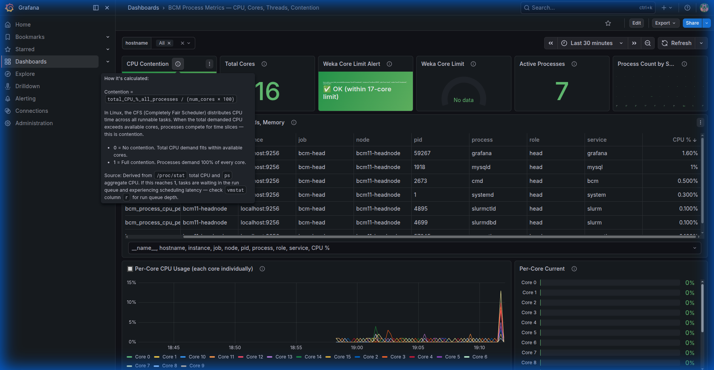
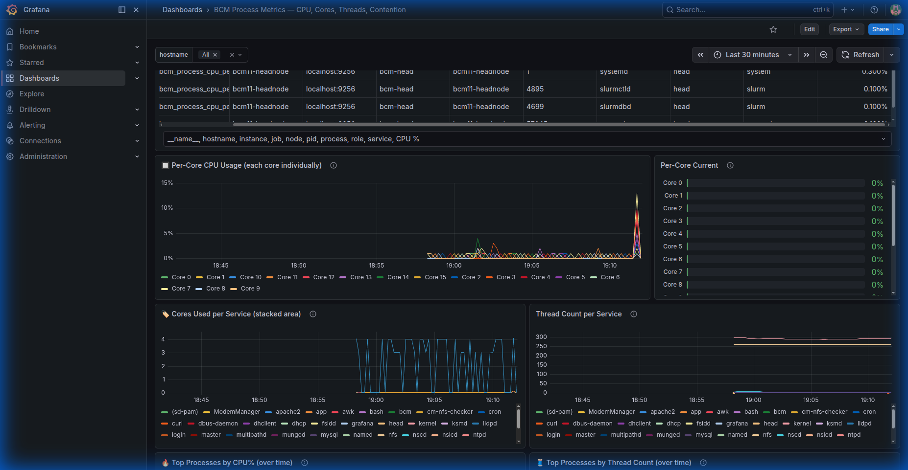
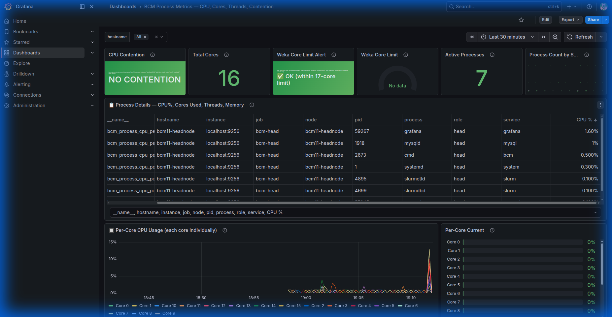
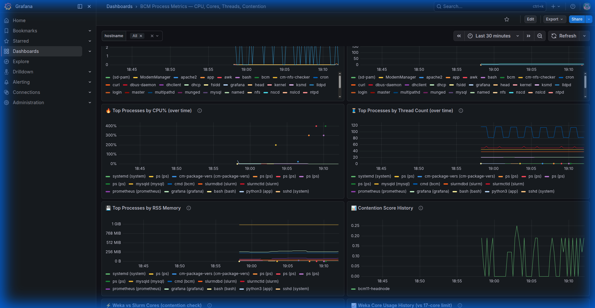
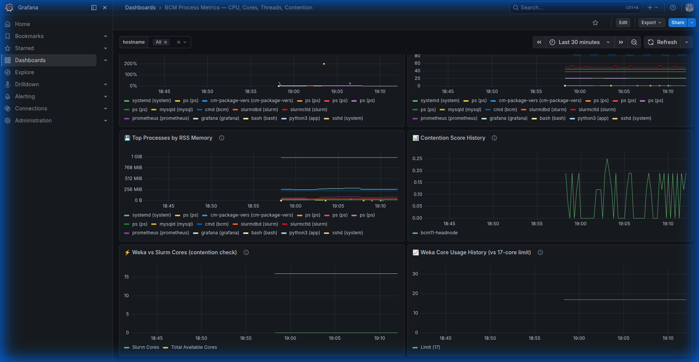

# BCM Process Metrics Monitoring

> Everything you need to monitor BCM node processes, CPU contention, and service health.

## Files

| File | Purpose |
|---|---|
| `bcm-process-metrics.sh` | Core metrics collector — Prometheus-format output |
| `setup-cmsh-monitoring.sh` | One-time setup: registers with BCM cmsh monitoring framework |
| `metrics-server.py` | Lightweight Python HTTP server for Prometheus scraping (:9256) |
| `start-metrics.sh` | Helper to start the HTTP endpoint |
| `generate-process-dashboard.py` | Generates the Grafana dashboard JSON (17 panels) |
| `bcm-process-metrics-dashboard.json` | Ready-to-import Grafana dashboard |
| `monitoring-deployment-proof.md` | Proof of working metrics with real output |
| `screenshots/` | 5 live Grafana screenshots showing data flowing |

## Quick Start

### 1. Deploy to BCM head node
```bash
scp bcm-process-metrics.sh setup-cmsh-monitoring.sh root@<HEAD>:/root/
ssh root@<HEAD> 'cp /root/bcm-process-metrics.sh /cm/local/apps/cmd/scripts/monitoring/'
ssh root@<HEAD> 'bash /root/setup-cmsh-monitoring.sh --interval 60'
```

### 2. Install Prometheus + Grafana
```bash
# On bcm-head:
apt install prometheus grafana   # or download binaries

# Configure Prometheus to scrape :9256
# Start metrics-server.py on each node
python3 metrics-server.py 9256

# Import dashboard JSON into Grafana
```

### 3. Verify
```bash
# Check cmsh monitoring
cmsh -c "monitoring; list"
cmsh -c "device; use node001; monitoring; get process-metrics"

# Check Prometheus targets
curl http://localhost:9090/api/v1/targets

# Open Grafana dashboard
open http://localhost:3000/d/bcm-process-metrics
```

## Dashboard Panels (17 total)

| # | Panel | Description |
|---|---|---|
| 1 | CPU Contention | NO CONTENTION / MODERATE / CONTENTION! (binary indicator) |
| 2 | Total Cores | Logical CPU cores from `nproc` |
| 3 | Weka Core Limit Alert | 0=OK, 1=exceeded 17-core limit |
| 4 | Weka Core Gauge | Current Weka core usage vs limit |
| 5 | Active Processes | Count of processes with CPU > 0% |
| 6 | Process Count by Service | Breakdown by category |
| 7 | Process Table | CPU%, Cores Used, Threads, RSS, Mem% |
| 8 | Per-Core Timeseries | /proc/stat diff for each core |
| 9 | Per-Core Bar Gauge | Current snapshot per core |
| 10 | Service Core Usage | Stacked area by service class |
| 11 | Thread Count per Service | Thread tracking over time |
| 12 | Top by CPU% | Top 10 CPU consumers over time |
| 13 | Top by Threads | Top 10 thread-heavy processes |
| 14 | Top by RSS | Memory usage over time |
| 15 | Contention History | Score trend with thresholds |
| 16 | Weka vs Slurm | Overlay showing core competition |
| 17 | Weka Core History | Usage vs 17-core limit |

## Screenshots






