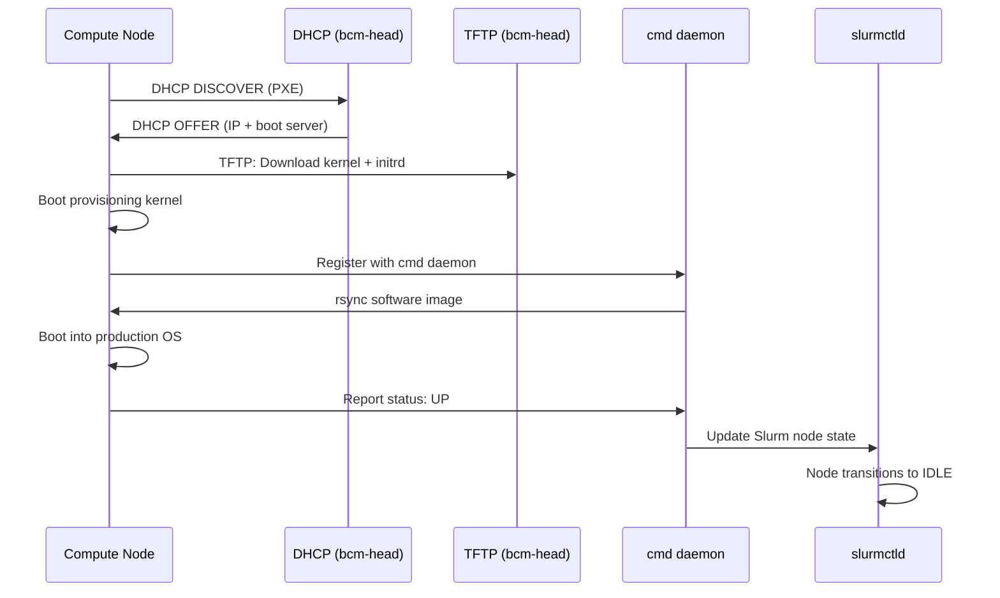

# NVIDIA Base Command Manager (BCM) 11.0 — Concepts Guide

> **Lab-Validated** — All examples from a live BCM 11.0 environment.

## Architecture Overview

```
┌──────────────────────────────────────────────────────┐
│                   BCM Head Node                       │
│  bcm11-headnode (192.168.200.254)                    │
│  ┌──────┐ ┌──────────┐ ┌──────────┐ ┌────────────┐  │
│  │ cmd  │ │slurmctld │ │ slurmdbd │ │  dhcpd     │  │
│  │daemon│ │          │ │          │ │  tftpd     │  │
│  │      │ │  Slurm   │ │  Slurm   │ │  named     │  │
│  │ BCM  │ │ Control  │ │ Database │ │ Provisioning│  │
│  └──────┘ └──────────┘ └──────────┘ └────────────┘  │
│            │                                          │
│     Management Network: internalnet (192.168.200.0/24)│
└────────────┼──────────────────────────────────────────┘
             │
    ┌────────┴────────┬─────────────────┐
    │                 │                 │
┌───┴───┐        ┌───┴───┐        ┌───┴───┐
│node001│        │node002│        │node003│
│ .200.1│        │ .200.2│        │ .200.3│
│ PXE   │        │ PXE   │        │ PXE   │
│ boot  │        │ boot  │        │ boot  │
└───────┘        └───────┘        └───────┘
  Category: default
  Image: default-image (kernel 6.8.0-51)
```

---

## Core Concepts

### 1. cmd Daemon

The **BCM Management Daemon** (`cmd`) is the central control service:

```bash
$ systemctl status cmd
● cmd.service - BCM daemon
     Active: active (running)
     Main PID: 2814 (safe_cmd)
     Memory: 278.0M
```

`cmd` manages:
- Node provisioning (PXE/DHCP/TFTP)
- Configuration distribution
- Health monitoring
- Network configuration (DHCP, DNS)
- Slurm integration

### 2. cmsh — Cluster Management Shell

`cmsh` is the CLI interface to BCM. It uses a **modal** system:

| Module | Purpose | Example |
|--------|---------|---------|
| `device` | Manage nodes | `cmsh -c 'device list'` |
| `category` | Node categories | `cmsh -c 'category list'` |
| `softwareimage` | OS images | `cmsh -c 'softwareimage list'` |
| `configurationoverlay` | Role configs | `cmsh -c 'configurationoverlay list'` |
| `partition` | Cluster partitions | `cmsh -c 'partition list'` |
| `network` | Networks | `cmsh -c 'network list'` |
| `monitoring` | Health checks | `cmsh -c 'monitoring setup; measurablelist'` |
| `kubernetes` | K8s integration | K8s cluster management |

**Interactive mode:**
```bash
$ cmsh
[bcm11-headnode]% device
[bcm11-headnode->device]% list
[bcm11-headnode->device]% use node001
[bcm11-headnode->device[node001]]% get status
[  DOWN  ], pingable
[bcm11-headnode->device[node001]]% set mac 52:54:00:8D:5D:F8
[bcm11-headnode->device*[node001*]]% commit
```

### 3. Devices

Devices are the nodes managed by BCM:

| Type | Hostname | MAC | Category | IP | Status |
|------|----------|-----|----------|----|--------|
| HeadNode | bcm11-headnode | 52:54:00:27:A5:0C | — | 192.168.200.254 | UP |
| PhysicalNode | node001 | 52:54:00:8D:5D:F8 | default | 192.168.200.1 | DOWN, pingable |
| PhysicalNode | node002 | 52:54:00:D0:19:FC | default | 192.168.200.2 | DOWN |
| PhysicalNode | node003 | 52:54:00:E0:F0:AB | default | 192.168.200.3 | DOWN |

### 4. Categories

Categories group nodes with the same OS image and configuration:

```
Category: default
├── Software Image: default-image
│   ├── Path: /cm/images/default-image
│   └── Kernel: 6.8.0-51-generic
└── Nodes: 3 (node001, node002, node003)
```

### 5. Configuration Overlays

Overlays apply **role-based configuration** to nodes:

```
┌─────────────────────┐     ┌─────────────────────┐
│  slurm-server       │     │  slurm-accounting   │
│  Priority: 500      │     │  Priority: 500      │
│  All Head Nodes: ✓  │     │  All Head Nodes: ✓  │
│  Role: slurmserver  │     │  Role: slurmaccounting│
└─────────────────────┘     └─────────────────────┘

┌─────────────────────┐     ┌─────────────────────┐
│  slurm-client       │     │  slurm-submit       │
│  Priority: 500      │     │  Priority: 500      │
│  Category: default  │     │  Category: default  │
│  Role: slurmclient  │     │  Role: slurmsubmit  │
└─────────────────────┘     └─────────────────────┘
```

- **Head node overlays** (`All HN: yes`): `slurm-server`, `slurm-accounting`, `wlm-headnode-submit`
- **Compute node overlays** (`Category: default`): `slurm-client`, `slurm-submit`

### 6. Software Images

BCM uses **stateless provisioning** — compute nodes PXE boot and receive their OS image from the head node:

```
default-image
├── Path: /cm/images/default-image
├── Kernel: 6.8.0-51-generic
├── Assigned to: 3 nodes (via category 'default')
└── Provisioning: rsync over SSH or daemon
```

### 7. Networks

```
externalnet    External   /24   192.168.200.0   nvidia.com      (no DHCP)
globalnet      Global     /0    0.0.0.0         cm.cluster
internalnet    Internal   /24   192.168.200.0   cluster.local   (DHCP/PXE)
```

- **internalnet**: Management network for provisioning, monitoring, and inter-node communication
- **externalnet**: External access network

---

## Slurm Integration

BCM manages Slurm through **configuration overlays**:

```
Slurm 25.05.5
├── Cluster: slurm
├── Control: 192.168.200.254:6817
├── Partition: defq (default)
│   ├── Nodes: node[001-003]
│   ├── MaxTime: UNLIMITED
│   └── State: UP
├── slurmctld → Head node (active)
├── slurmdbd → Head node (active)
└── slurmd → Compute nodes (after provisioning)
```

### Key Slurm Commands

```bash
sinfo                      # Quick cluster overview
sinfo -l                   # Detailed view
scontrol show nodes        # Node details
scontrol show partitions   # Partition config
squeue                     # Running/pending jobs
sacctmgr show cluster      # Accounting cluster info
scontrol update nodename=X state=resume  # Resume a node
```

---

## BCM Web UI — Base View

Access at `https://<headnode>:8081/base-view/` (admin/system).

| Section | Shows |
|---------|-------|
| **Cluster Overview** | CPU/Memory utilization, device status |
| **Devices** | All managed nodes with UP/DOWN status |
| **Monitoring** | Service health checks (Pass/Fail) |
| **HPC → Jobs** | Slurm job queue and history |
| **Provisioning** | Node image deployment status |

---

## Provisioning Workflow


