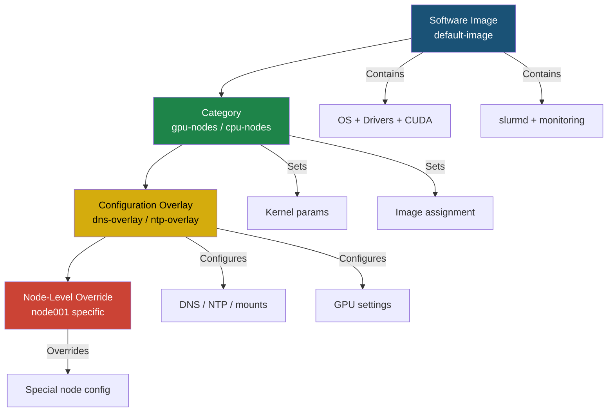

# BCM DNS Configuration & Image vs Overlay Best Practices

> **SOP: BCM Configuration Management**
> Covers DNS setup via categories/overlays, and the authoritative guide for what belongs in the **software image** vs. **configuration overlays**.

---

## 1. DNS Configuration on Managed Nodes

### How BCM Manages DNS

BCM generates `/etc/resolv.conf` on compute nodes **automatically** using settings from three layers (in priority order):

| Priority | Layer | cmsh Path | Overrides |
|----------|-------|-----------|-----------|
| **750** | Node-level | `device use <node>` | Everything |
| **500** | Configuration Overlay | `configurationoverlay use <overlay>` | Category |
| **250** | Category-level | `category use <category>` | Nothing |

BCM's `cmd` daemon pushes DNS settings derived from the **network** object and the **nameservers** configured at the global/base level.

### Configuring DNS via Category (Recommended for Per-Group DNS)

```bash
# View current global nameservers
cmsh -c "base; get nameservers"

# Set cluster-wide nameservers
cmsh -c "base; set nameservers 8.8.8.8 8.8.4.4; commit"

# Set DNS search domain via network
cmsh -c "network; use internalnet; get domainname"
cmsh -c "network; use internalnet; set domainname lab.local; commit"
```

### Configuring DNS Per-Category

```bash
# Create a category-level configuration with DNS roles
cmsh << 'EOF'
category
use default
roles
use resolvconf
set nameservers 10.0.0.1 10.0.0.2
set searchdomains "lab.local corp.internal"
commit
EOF
```

### Configuring DNS via Configuration Overlay

```bash
# Create a DNS overlay for a specific node group
cmsh << 'EOF'
configurationoverlay
add dns-overlay
set priority 600
roles
add resolvconf
set nameservers 10.0.0.1 10.0.0.2
set searchdomains "gpu-cluster.local"
commit
# Assign nodes to this overlay
configurationoverlay
use dns-overlay
assign node001 node002 node003
commit
EOF
```

### Verification Commands

```bash
# Check what DNS a node sees
cmsh -c "device; use node001; roles; use resolvconf; get nameservers"

# Check from the node itself
ssh node001 "cat /etc/resolv.conf"

# Check network domain
cmsh -c "network; use internalnet; get domainname"

# Test DNS resolution from node
ssh node001 "nslookup google.com; dig +short bcm11-headnode"
```

---

## 2. Image vs Overlay: What Goes Where

### Decision Framework

```
┌─────────────────────────────────────────────────────────────┐
│                    DECISION TREE                             │
│                                                              │
│  Is it a binary/package that ALL nodes need?                │
│  ├── YES → SOFTWARE IMAGE                                   │
│  └── NO                                                      │
│      Is it a config file that varies by node group?         │
│      ├── YES → CONFIGURATION OVERLAY                        │
│      └── NO                                                  │
│          Is it a cluster-wide setting?                      │
│          ├── YES → GLOBAL/BASE settings                     │
│          └── NO → NODE-LEVEL override                       │
└─────────────────────────────────────────────────────────────┘
```

### The Definitive Matrix

| Configuration | In Image? | In Overlay? | Rationale |
|---|---|---|---|
| **OS base packages** | ✅ | ❌ | Foundational — same for all nodes |
| **NVIDIA GPU drivers** | ✅ | ❌ | Binary, must match kernel in image |
| **CUDA toolkit** | ✅ | ❌ | Compiled binaries, kernel-dependent |
| **Container runtime** | ✅ | ❌ | `nvidia-container-toolkit`, `containerd` |
| **Slurm client** (`slurmd`) | ✅ | ❌ | Provisioned, version-locked with controller |
| **Monitoring agents** | ✅ | ❌ | Prometheus node-exporter, DCGM exporter |
| **System libs** (`glibc`, `openssl`) | ✅ | ❌ | ABI compatibility across all nodes |
| **Kernel + modules** | ✅ | ❌ | PXE boot kernel sourced from image |
| `/etc/resolv.conf` | ❌ | ✅ | Varies by environment/node group |
| **NTP servers** | ❌ | ✅ | `base; set timeservers` or overlay |
| **LDAP client config** | ❌ | ✅ | Server addresses vary by deployment |
| **LDAP client packages** (`sssd`) | ✅ | ❌ | Binary package lives in image |
| **Slurm config** (`slurm.conf`) | ❌ | ✅ | BCM generates via roles, differs per partition |
| **GPU-specific settings** | ❌ | ✅ | `nvidia-persistenced`, power mode |
| **Network bonding** | ❌ | ✅ | Varies by node type (IB vs ETH) |
| **Mount points** (`/scratch`, NFS) | ❌ | ✅ | Different per project/tenant |
| **SSH authorized_keys** | ❌ | ✅ | Admin keys via overlay, user keys via LDAP |
| **Firewall rules** | ❌ | ✅ | Varies per zone/node role |
| **cron jobs** | ❌ | ✅ | Maintenance scripts vary per role |
| **Kernel parameters** | ❌ | ✅ | `category; set kernelparameters` |
| **sysctl tuning** | ❌ | ✅ | GPU vs CPU nodes have different tuning |

### The Golden Rules

> [!IMPORTANT]
> **Rule 1**: If it's a **binary/package** → **IMAGE**
> **Rule 2**: If it's a **config file that varies** → **OVERLAY**
> **Rule 3**: If it's a **cluster-wide setting** → **BASE/GLOBAL**
> **Rule 4**: Never edit files inside a running node — they get **wiped on reprovision**

### Why This Matters



---

## 3. Common Recipes

### Recipe: Add Custom DNS to GPU Nodes Only

```bash
cmsh << 'EOF'
configurationoverlay
add gpu-dns
set priority 600
roles
add resolvconf
set nameservers 10.10.10.1 10.10.10.2
set searchdomains "gpu.cluster.local"
commit
configurationoverlay
use gpu-dns
assign node003
commit
EOF
```

### Recipe: Install Package in Image (Not Overlay)

```bash
# Correct: Install in the software image
cmsh -c "softwareimage; use default-image; chroot"
# Inside chroot:
apt install -y nvidia-container-toolkit
exit
cmsh -c "softwareimage; use default-image; close"

# Then push to nodes
cmsh -c "device; foreach -c default (imageupdate)"
```

### Recipe: Set NTP Servers Cluster-Wide

```bash
cmsh -c "base; set timeservers ntp1.corp.com ntp2.corp.com; commit"
```

### Recipe: Set Kernel Parameters by Category

```bash
cmsh -c "category; use default; set kernelparameters 'iommu=pt intel_iommu=on'; commit"
```

### Recipe: Change Node Category

```bash
cmsh -c "device; use node003; set category gpu-nodes; commit"
```

---

## 4. Ansible Playbook: Audit DNS Configuration

```yaml
---
- name: BCM DNS Configuration Audit
  hosts: headnode
  gather_facts: false
  tasks:
    - name: Get global nameservers
      shell: cmsh -c "base; get nameservers"
      register: global_dns

    - name: Get network domain
      shell: cmsh -c "network; use internalnet; get domainname"
      register: net_domain

    - name: Check DNS on each node
      shell: |
        for node in node001 node002 node003; do
          echo "=== $node ==="
          ssh -o StrictHostKeyChecking=no $node "cat /etc/resolv.conf" 2>/dev/null || echo "UNREACHABLE"
        done
      register: node_dns

    - name: Display results
      debug:
        msg: |
          Global DNS: {{ global_dns.stdout }}
          Network Domain: {{ net_domain.stdout }}
          Node DNS:
          {{ node_dns.stdout }}
```

---

## 5. Anti-Patterns to Avoid

| ❌ Don't | ✅ Do Instead |
|---|---|
| Edit `/etc/resolv.conf` directly on a node | Use `cmsh` roles or overlays |
| Install GPU drivers via `ssh node apt install` | Install in software image via `chroot` |
| Hardcode NTP in the image's `/etc/ntp.conf` | Set via `base; set timeservers` |
| Copy configs manually to each node | Use configuration overlays |
| Put environment-specific configs in image | Use overlays with different priorities |
| Modify running node's systemd units | Add roles to category or overlay |

---

## 6. Configuration Priority Reference

```
Node-level roles    (priority 750) ──► HIGHEST — wins all conflicts
  │
Configuration Overlay roles (priority 500, adjustable)
  │
Category-level roles (priority 250)
  │
Software Image content ──► LOWEST — base files, overridden by all above
```

> [!TIP]
> If a setting "isn't sticking" after provisioning, check if a higher-priority layer is overriding it. Use `cmsh -c "device; use <node>; roles; list"` to see the effective role stack.
