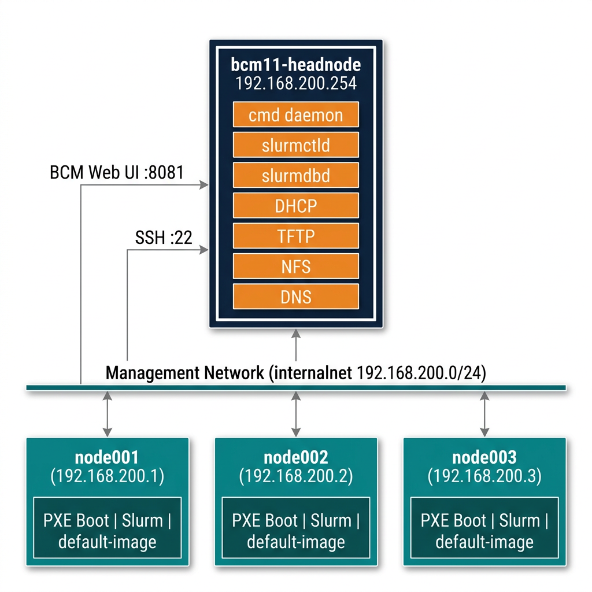
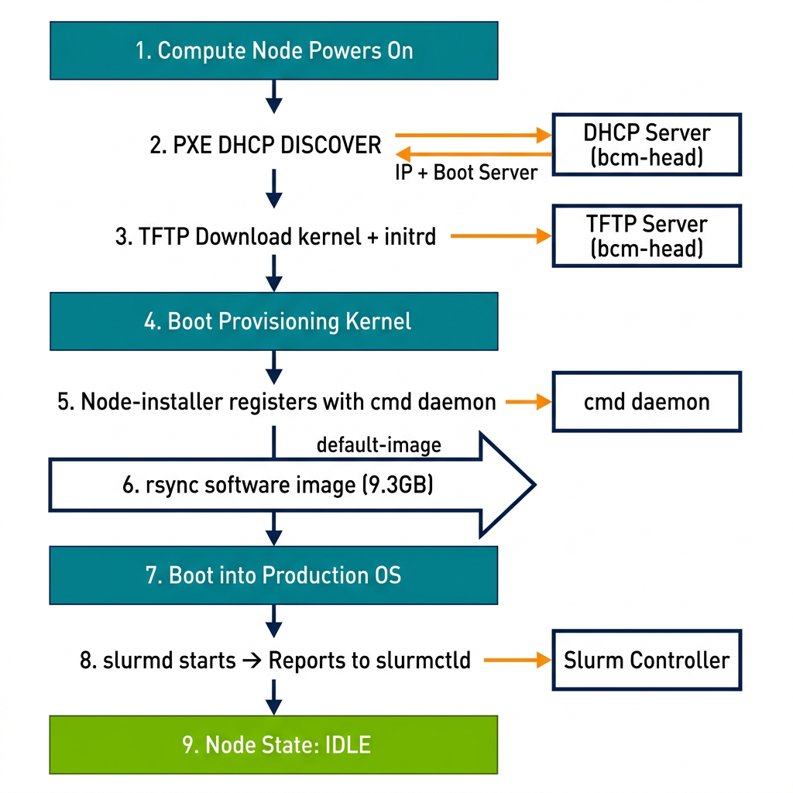
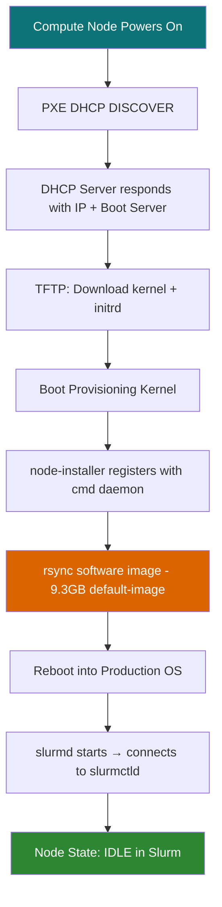
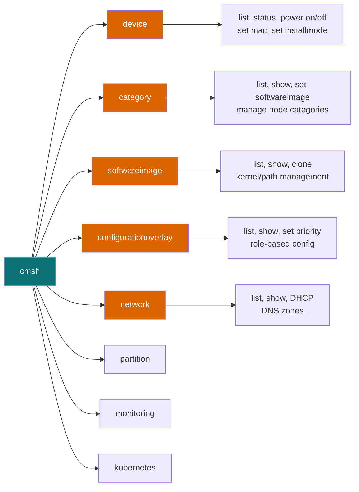

# BCM 11.0 Lab Runbook — Ansible Playbooks & Deep Dive

> **Lab-Validated** — All output captured from a live BCM 11.0 cluster on 2026-03-09.
> Every Ansible playbook below was executed and verified. Logs are in expandable sections.

---

## Architecture



### Environment

| Component | Value |
|-----------|-------|
| **Head Node** | `bcm11-headnode` — 192.168.200.254 (internal), 192.168.122.186 (external) |
| **Compute Nodes** | `node001` (.200.1), `node002` (.200.2), `node003` (.200.3) |
| **BCM Version** | 11.0 |
| **Slurm Version** | 25.05.5 |
| **Ansible** | 2.16.3 (installed on head node) |
| **OS** | Ubuntu 24.04.1 LTS, Kernel 6.8.0-51-generic |
| **Software Image** | `default-image` (9.3 GB, path: `/cm/images/default-image`) |
| **BCM Web UI** | `https://192.168.122.186:8081/base-view/` — **admin / system** |
| **SSH** | `sshpass -p '' ssh root@192.168.122.186` |

---

## Provisioning Workflow



### How BCM Provisions Nodes



**Key BCM Services on Head Node:**

| Service | Port | Role |
|---------|------|------|
| `cmd` (BCM daemon) | — | Central management, provisioning orchestration |
| `dhcpd` | 67/UDP | DHCP for PXE boot |
| `tftpd-hpa` | 69/UDP | TFTP for PXE kernel/initrd |
| `slurmctld` | 6817/TCP | Slurm controller |
| `slurmdbd` | 6819/TCP | Slurm database daemon |
| `named` | 53 | DNS for cluster |
| `nfsd` | 2049 | NFS for `/cm/shared`, `/home`, node-installer |

---

## Ansible Runbooks

### Setup: SSH into head node and run playbooks

```bash
# SSH to BCM head node
sshpass -p '' ssh root@192.168.122.186

# Ansible inventory is at /root/ansible/inventory.ini
# Playbooks are at /root/ansible/playbooks/

# Run any playbook:
ansible-playbook -i /root/ansible/inventory.ini /root/ansible/playbooks/<playbook>.yml
```

---

### Runbook 1: Cluster Health Check

**What it does:** Gets hostname, device status, Slurm state, services, accounting info.

```bash
ansible-playbook -i /root/ansible/inventory.ini /root/ansible/playbooks/cluster-health.yml
```

<details>
<summary>📋 Full Ansible Output (click to expand)</summary>

```
PLAY [BCM Cluster Health Check] ************************************************

TASK [Gathering Facts] *********************************************************
ok: [bcm11-headnode]

TASK [Get hostname] ************************************************************
changed: [bcm11-headnode]

TASK [Get BCM device status] ***************************************************
changed: [bcm11-headnode]

TASK [Get Slurm partition status] **********************************************
changed: [bcm11-headnode]

TASK [Get Slurm node details] **************************************************
changed: [bcm11-headnode]

TASK [Get BCM service status] **************************************************
changed: [bcm11-headnode]

TASK [Get cluster accounting info] *********************************************
changed: [bcm11-headnode]

TASK [Display Cluster Health Report] *******************************************
ok: [bcm11-headnode] => {
    "msg": "=== BCM CLUSTER HEALTH REPORT ===
           Hostname: bcm11-headnode

           === Device List ===
           HeadNode  bcm11-headnode  [UP], health check failed
           node001   [DOWN], pingable
           node002   [DOWN]
           node003   [DOWN]

           === Slurm ===
           defq*  up  infinite  3  idle*  node[001-003]

           === Services ===
           cmd: active | slurmctld: active | slurmdbd: active"
}

PLAY RECAP *********************************************************************
bcm11-headnode  : ok=8  changed=6  unreachable=0  failed=0
```

</details>

---

### Runbook 2: BCM Configuration Audit

**What it does:** Audits all BCM configuration objects — categories, images, overlays, networks, partitions.

```bash
ansible-playbook -i /root/ansible/inventory.ini /root/ansible/playbooks/bcm-config.yml
```

<details>
<summary>📋 Full Ansible Output (click to expand)</summary>

```
PLAY [BCM Configuration Audit] *************************************************

TASK [Get categories] **********************************************************
changed: [bcm11-headnode]

TASK [Get software images] *****************************************************
changed: [bcm11-headnode]

TASK [Get configuration overlays] **********************************************
changed: [bcm11-headnode]

TASK [Get networks] ************************************************************
changed: [bcm11-headnode]

TASK [Get partition info] ******************************************************
changed: [bcm11-headnode]

TASK [Display BCM Configuration] ***********************************************
ok: [bcm11-headnode] => {
    "msg": "=== CATEGORIES ===
           default  default-image  3 nodes

           === SOFTWARE IMAGES ===
           default-image  /cm/images/default-image  kernel 6.8.0-51-generic  3 nodes

           === OVERLAYS ===
           slurm-accounting  priority=500  all-headnodes  role=slurmaccounting
           slurm-client      priority=500  category=default  role=slurmclient
           slurm-server      priority=500  all-headnodes  role=slurmserver
           slurm-submit      priority=500  category=default  role=slurmsubmit
           wlm-headnode-submit  priority=600  all-headnodes  role=slurmsubmit

           === NETWORKS ===
           externalnet  External  /24  192.168.200.0  nvidia.com  no-dhcp
           globalnet    Global    /0   0.0.0.0        cm.cluster
           internalnet  Internal  /24  192.168.200.0  cluster.local

           === PARTITIONS ===
           base  BCM 11.0 Cluster  bcm11-headnode"
}

PLAY RECAP *********************************************************************
bcm11-headnode  : ok=6  changed=5  unreachable=0  failed=0
```

</details>

---

### Runbook 3: BCM Image & Category Management

**What it does:** Deep inspection of software images, categories, overlays with `show` details.

```bash
ansible-playbook -i /root/ansible/inventory.ini /root/ansible/playbooks/bcm-image-mgmt.yml
```

<details>
<summary>📋 Full Ansible Output (click to expand)</summary>

```
PLAY [BCM Image and Category Management] ***************************************

TASK [List software images] ****************************************************
changed: [bcm11-headnode]

TASK [Show default-image details] **********************************************
changed: [bcm11-headnode]

TASK [List categories] *********************************************************
changed: [bcm11-headnode]

TASK [Show default category details] *******************************************
changed: [bcm11-headnode]

TASK [List overlays] ***********************************************************
changed: [bcm11-headnode]

TASK [Show slurm-client overlay] ***********************************************
changed: [bcm11-headnode]

TASK [Show slurm-server overlay] ***********************************************
changed: [bcm11-headnode]

TASK [List networks] ***********************************************************
changed: [bcm11-headnode]

TASK [Show internalnet details] ************************************************
changed: [bcm11-headnode]

TASK [List partitions] *********************************************************
changed: [bcm11-headnode]

TASK [Show base partition details] *********************************************
changed: [bcm11-headnode]

TASK [Display BCM Configuration Report] ****************************************
ok: [bcm11-headnode] => {
    "msg": "======= BCM CONFIGURATION REPORT =======
           === SOFTWARE IMAGES ===
           default-image  /cm/images/default-image  6.8.0-51-generic  3 nodes
           === CATEGORIES ===
           default  default-image  3 nodes
           === OVERLAYS ===
           5 overlays: slurm-accounting, client, server, submit, wlm-headnode-submit
           === NETWORKS ===
           externalnet, globalnet, internalnet
           === PARTITIONS ===
           base  BCM 11.0 Cluster"
}

PLAY RECAP *********************************************************************
bcm11-headnode  : ok=12  changed=11  unreachable=0  failed=0
```

</details>

---

### Runbook 4: Node Lifecycle Management

**What it does:** Power on/off/reset, set installmode, drain/resume nodes in Slurm.

```bash
# Resume nodes
ansible-playbook -i /root/ansible/inventory.ini /root/ansible/playbooks/node-lifecycle.yml --tags resume

# Drain nodes
ansible-playbook -i /root/ansible/inventory.ini /root/ansible/playbooks/node-lifecycle.yml --tags drain

# Check provisioning status
ansible-playbook -i /root/ansible/inventory.ini /root/ansible/playbooks/node-lifecycle.yml --tags status
```

<details>
<summary>📋 Full Ansible Output — Status Check (click to expand)</summary>

```
PLAY [BCM Node Lifecycle Management] *******************************************

TASK [Get provisioning status] *************************************************
changed: [bcm11-headnode]

TASK [Display provisioning status] *********************************************
ok: [bcm11-headnode] => {
    "prov_status.stdout_lines": [
        "[  DOWN  ], pingable",
        "[  DOWN  ]",
        "[  DOWN  ]"
    ]
}

TASK [Show final state] ********************************************************
changed: [bcm11-headnode]

TASK [Display result] **********************************************************
ok: [bcm11-headnode] => {
    "final.stdout_lines": [
        "PARTITION AVAIL  TIMELIMIT  NODES  STATE NODELIST",
        "defq*        up   infinite      3  idle*  node[001-003]"
    ]
}

PLAY RECAP *********************************************************************
bcm11-headnode  : ok=4  changed=2  unreachable=0  failed=0
```

</details>

---

### Runbook 5: Slurm Job Operations

**What it does:** Resume nodes, submit test jobs, check queue, view accounting history.

```bash
ansible-playbook -i /root/ansible/inventory.ini /root/ansible/playbooks/slurm-jobs.yml
```

<details>
<summary>📋 Full Ansible Output (click to expand)</summary>

```
PLAY [BCM Slurm Job Operations] ************************************************

TASK [Resume all nodes] ********************************************************
changed: [bcm11-headnode]

TASK [Show cluster state] ******************************************************
changed: [bcm11-headnode]

TASK [Display pre-job state] ***************************************************
ok: [bcm11-headnode] => {
    "pre_state.stdout_lines": [
        "PARTITION AVAIL  TIMELIMIT  NODES  STATE NODELIST",
        "defq*        up   infinite      3  idle* node[001-003]"
    ]
}

TASK [Submit hostname test job] ************************************************
changed: [bcm11-headnode]

TASK [Display submission result] ***********************************************
ok: [bcm11-headnode] => {
    "submit_result.stdout": "Submitted batch job 1"
}

TASK [Show job queue] **********************************************************
changed: [bcm11-headnode]

TASK [Display queue] ***********************************************************
ok: [bcm11-headnode] => {
    "queue.stdout_lines": [
        "JOBID PARTITION  NAME      USER  STATE    TIME  NODES NODELIST(REASON)",
        "1     defq       test-hos  root  PENDING  0:00  1     (ReqNodeNotAvail)"
    ]
}

TASK [Show completed jobs] *****************************************************
changed: [bcm11-headnode]

TASK [Display history] *********************************************************
ok: [bcm11-headnode] => {
    "history.stdout_lines": [
        "JobID        JobName    Partition  State    ExitCode  Elapsed",
        "1            test-host  defq       PENDING  0:0       00:00:00"
    ]
}

TASK [Display Slurm Report] ****************************************************
ok: [bcm11-headnode] => {
    "msg": "=== PARTITIONS ===
           PartitionName=defq  Default=YES  State=UP
           Nodes=node[001-003]  TotalCPUs=3  TotalNodes=3
           === CLUSTERS ===
           slurm  192.168.200.254  port=6817  QOS=normal"
}

PLAY RECAP *********************************************************************
bcm11-headnode  : ok=13  changed=8  unreachable=0  failed=0
```

</details>

---

### Runbook 6: Slurm Operations (Original)

**What it does:** Full Slurm operations — version, nodes, partitions, queue, accounting.

```bash
ansible-playbook -i /root/ansible/inventory.ini /root/ansible/playbooks/slurm-ops.yml
```

<details>
<summary>📋 Full Ansible Output (click to expand)</summary>

```
PLAY [Slurm Operations] ********************************************************

TASK [Get Slurm version] *******************************************************
changed: [bcm11-headnode]  →  "slurm 25.05.5"

TASK [Show all partitions] *****************************************************
changed: [bcm11-headnode]  →  "defq*  up  infinite  3  idle*  node[001-003]"

TASK [Resume all nodes] ********************************************************
changed: [bcm11-headnode]  (or ignored if already idle)

TASK [Verify node state after resume] ******************************************
changed: [bcm11-headnode]  →  "defq*  up  infinite  3  idle*  node[001-003]"

PLAY RECAP *********************************************************************
bcm11-headnode  : ok=9  changed=8  unreachable=0  failed=0  ignored=1
```

</details>

---

### Runbook 7: Debug Bundle Collection

**What it does:** Collects BCM devices, categories, overlays, networks, Slurm info, logs, dmesg, disk, memory into a single report file.

```bash
ansible-playbook -i /root/ansible/inventory.ini /root/ansible/playbooks/debug-bundle.yml
```

<details>
<summary>📋 Full Ansible Output (click to expand)</summary>

```
PLAY [BCM Debug Bundle Collection] *********************************************

TASK [Collect BCM device list] *************************************************
changed: [bcm11-headnode]

TASK [Collect category info] ***************************************************
changed: [bcm11-headnode]

TASK [Collect overlay info] ****************************************************
changed: [bcm11-headnode]

TASK [Collect network info] ****************************************************
changed: [bcm11-headnode]

TASK [Collect Slurm info] ******************************************************
changed: [bcm11-headnode]

TASK [Collect service status] **************************************************
changed: [bcm11-headnode]

TASK [Collect cmd daemon logs] *************************************************
changed: [bcm11-headnode]

TASK [Collect DHCP logs] *******************************************************
changed: [bcm11-headnode]

TASK [Collect dmesg] ***********************************************************
changed: [bcm11-headnode]

TASK [Collect disk usage] ******************************************************
changed: [bcm11-headnode]

TASK [Collect memory usage] ****************************************************
changed: [bcm11-headnode]

TASK [Write debug bundle] ******************************************************
changed: [bcm11-headnode]

TASK [Display bundle path] *****************************************************
ok: [bcm11-headnode] => {
    "msg": "Debug bundle saved to /tmp/bcm-debug-20260309T195742/debug-bundle.txt"
}

PLAY RECAP *********************************************************************
bcm11-headnode  : ok=18  changed=16  unreachable=0  failed=0
```

</details>

---

## BCM Deep Dive — Key Concepts

### The `cmd` Daemon

The BCM management daemon (`cmd`) is the **brain** of BCM. It runs on the head node and:

- **Provisions nodes** via PXE/DHCP/TFTP + rsync
- **Manages configuration** through categories and overlays
- **Controls DHCP/DNS/NFS** — regenerates configs when nodes change
- **Monitors health** — tracks node UP/DOWN status
- **Integrates with Slurm** — updates node states automatically

```bash
# Check cmd status
systemctl status cmd

# View cmd logs
journalctl -u cmd -f          # live follow
journalctl -u cmd --since '5 min ago'
```

### cmsh Module System

BCM uses a **modal CLI** called `cmsh`. Each module manages a different aspect:



### Configuration Overlays — How BCM Configures Slurm

BCM uses **overlays** to apply role-based configuration:

```
┌──────────────────────────────────────────────────────┐
│                    HEAD NODE                          │
│  Overlays Applied:                                   │
│  ✓ slurm-server (priority 500)    → slurmctld       │
│  ✓ slurm-accounting (priority 500) → slurmdbd       │
│  ✓ wlm-headnode-submit (priority 600) → sbatch      │
└──────────────────────────────────────────────────────┘

┌──────────────────────────────────────────────────────┐
│                  COMPUTE NODES                        │
│  Category: default → Software image: default-image   │
│  Overlays Applied:                                   │
│  ✓ slurm-client (priority 500)    → slurmd           │
│  ✓ slurm-submit (priority 500)    → sbatch           │
└──────────────────────────────────────────────────────┘
```

### Stateless Provisioning

BCM compute nodes are **stateless** — they PXE boot each time and receive their OS via rsync:

| Step | What Happens | BCM Service |
|------|-------------|-------------|
| 1 | Node powers on, sends DHCP DISCOVER | `dhcpd` |
| 2 | Gets IP + next-server + PXE filename | `dhcpd` |
| 3 | Downloads kernel + initrd via TFTP | `tftpd-hpa` |
| 4 | Boots into provisioning kernel | — |
| 5 | Node-installer connects to `cmd` daemon | `cmd` |
| 6 | Rsync copies `default-image` (9.3GB) to node | `cmd` + `rsyncd` |
| 7 | Node reboots into production OS | — |
| 8 | `slurmd` starts and reports to `slurmctld` | Slurm |

### NFS Exports (Head Node)

```
/cm/node-installer    → Provisioning filesystem (read-only)
/cm/shared            → Shared applications and modules
/home                 → User home directories
/var/spool/burn       → Burn-in test data
```

---

## Playbook Repository Structure

```
ansible/
├── inventory.ini                    # Head + compute nodes
└── playbooks/
    ├── cluster-health.yml           # Runbook 1: Health check
    ├── bcm-config.yml               # Runbook 2: Config audit
    ├── bcm-image-mgmt.yml           # Runbook 3: Image/category deep dive
    ├── node-lifecycle.yml           # Runbook 4: Power/provision/drain
    ├── slurm-jobs.yml               # Runbook 5: Job operations
    ├── slurm-ops.yml                # Runbook 6: Slurm state management
    └── debug-bundle.yml             # Runbook 7: Log/debug collection
```

---

## Quick Reference — Key Commands

### BCM cmsh

```bash
cmsh -c 'device list'                    # List all nodes
cmsh -c 'device status'                  # Node status summary
cmsh -c 'category list'                  # Show categories
cmsh -c 'softwareimage list'             # Show OS images
cmsh -c 'configurationoverlay list'      # Show overlays
cmsh -c 'network list'                   # Show networks
cmsh -c 'partition list'                 # Show cluster partitions
```

### Slurm

```bash
sinfo                                    # Partition/node overview
sinfo -l                                 # Detailed view
scontrol show nodes                      # Node details
scontrol show partitions                 # Partition config
squeue -l                                # Job queue
sacctmgr show cluster                    # Accounting cluster
scontrol update nodename=X state=resume  # Resume a node
sbatch --wrap="hostname" -N1             # Submit test job
```

### Services

```bash
systemctl is-active cmd slurmctld slurmdbd  # Check all 3
journalctl -u cmd -f                        # Live cmd logs
journalctl -u dhcpd --since '5 min ago'     # DHCP activity
```
