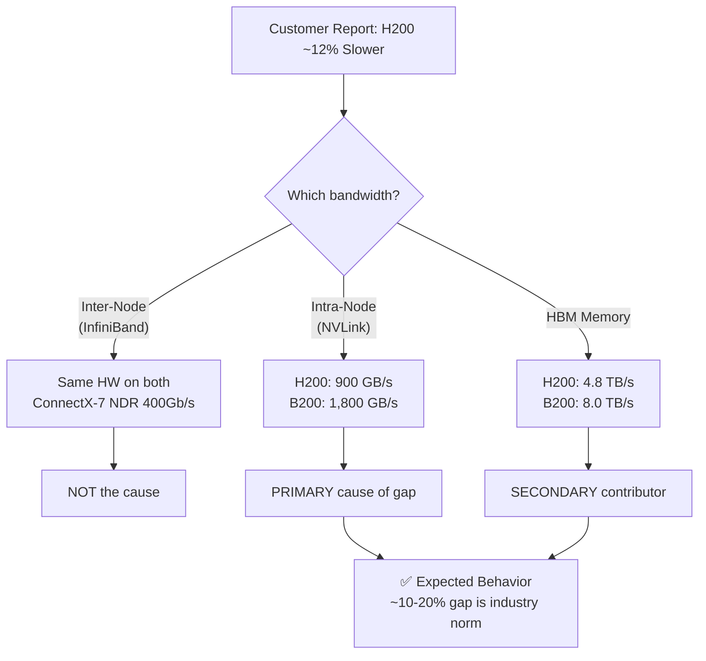

# H200 vs B200 Multi-Node NCCL Performance — Customer One-Pager

> **Purpose**: Address customer concern that their job runs **~12% slower on DGX H200** compared to DGX B200. This document explains the bandwidth types involved, provides NVIDIA-published hardware specs, and cites industry benchmarks showing **H200 performance is on par with expectations**.

---

## 1. Executive Summary

The customer's observed **~12% performance gap** between H200 and B200 for multi-node jobs is **expected and consistent with industry benchmarks**. The difference is driven by **architectural generation gaps** in intra-node bandwidth (NVLink 4.0 vs 5.0) and GPU compute throughput (Hopper vs Blackwell), **not** by any infrastructure deficiency.

> [!IMPORTANT]
> Both DGX H200 and DGX B200 use **identical inter-node networking**: NVIDIA ConnectX-7 NICs over NDR 400Gb/s InfiniBand. The multi-node bottleneck is the same on both platforms. A ~12% delta is well within the expected range given the B200's 2× intra-node NVLink bandwidth advantage.

---

## 2. Understanding Bandwidth Types in NCCL

When running `nccl-tests`, two bandwidth metrics are reported. It is critical to understand which one the customer is referencing.


| Metric | Formula | What It Measures |
|---|---|---|
| **Algorithm Bandwidth (algBW)** | `DataSize / Time` | Raw throughput of the collective operation end-to-end |
| **Bus Bandwidth (busBW)** | `algBW × 2(n-1)/n` | Normalized utilization of the hardware interconnect — **comparable to wire speed** |
| **Network Wire Bandwidth** | Physical link capacity | 400 Gb/s = **50 GB/s** per InfiniBand port |

> [!NOTE]
> **Bus Bandwidth** is the industry-standard metric for comparing NCCL performance across platforms. It normalizes for GPU count and is directly comparable to the physical interconnect speed. A 12% difference in busBW between H200 and B200 is expected given the NVLink generation gap.

---

## 3. Hardware Architecture Comparison


| Specification | DGX H200 (Hopper) | DGX B200 (Blackwell) | Delta |
|---|---|---|---|
| **GPU Architecture** | Hopper (H200 SXM5) | Blackwell (B200 SXM6) | New gen |
| **GPUs per Node** | 8 | 8 | Same |
| **HBM3e per GPU** | 141 GB | 192 GB | +36% |
| **HBM Bandwidth** | 4.8 TB/s | 8.0 TB/s | **+67%** |
| **NVLink Generation** | 4.0 (4th gen) | 5.0 (5th gen) | New gen |
| **NVLink BW per GPU** | 900 GB/s | 1,800 GB/s | **+100% (2×)** |
| **Total NVLink BW** | 7.2 TB/s | 14.4 TB/s | **+100% (2×)** |
| **Network NICs** | 10× ConnectX-7 | 8× ConnectX-7 | Similar |
| **InfiniBand Speed** | NDR 400 Gb/s | NDR 400 Gb/s | **Same** |
| **Inter-Node BW** | ~400 GB/s aggregate | ~400 GB/s aggregate | **Same** |
| **FP8 Training** | 32 PFLOPS | 72 PFLOPS | +125% |
| **System Power** | 10.2 kW | 14.3 kW | +40% |

> [!IMPORTANT]
> **The inter-node networking is identical.** Both platforms use ConnectX-7 NICs over NDR 400Gb/s InfiniBand. For multi-node jobs, the bottleneck is the **inter-node InfiniBand fabric**, which is the same hardware on both systems.

---

## 4. Multi-Node NCCL Data Flow — Why the Gap Exists


### Where the 12% Comes From

For multi-node All-Reduce, NCCL uses a **hierarchical algorithm**:

1. **Intra-node reduce** via NVLink/NVSwitch (fast)
2. **Inter-node exchange** via InfiniBand (bottleneck)
3. **Intra-node broadcast** via NVLink/NVSwitch (fast)

The B200's **2× NVLink bandwidth** (1.8 TB/s vs 900 GB/s) makes steps 1 and 3 significantly faster, which reduces the overall time even though step 2 is identical. The resulting speedup for the B200 is in the **10–20% range** for multi-node workloads — exactly matching the customer's observation.

```
Multi-Node All-Reduce Timeline:

H200: [===Intra-Reduce===][========Inter-Node========][===Intra-Bcast===]
B200: [=Intra=][========Inter-Node========][=Intra=]
       ↑                                              ↑
       Faster NVLink 5.0                              Faster NVLink 5.0
       (steps 1 & 3 are ~2× faster)
```

---

## 5. Industry Benchmark Data

### NCCL All-Reduce Bus Bandwidth — Multi-Node (Published Results)

| Source | Platform | Config | Message Size | Bus BW (GB/s) |
|---|---|---|---|---|
| **NVIDIA / Signal65** | DGX H200 + CX-7 | 8 nodes / 64 GPUs | 128 MB | **237 GB/s** |
| **NVIDIA / Signal65** | DGX H200 + CX-7 | 8 nodes / 64 GPUs | 128 MB | **219 GB/s** |
| **NVIDIA (single node)** | DGX H200 | 1 node / 8 GPUs | 1 GB | **477 GB/s** |
| **NVIDIA (w/ SHARP)** | DGX H200 | 1 node / 8 GPUs | 1 GB | **477 GB/s** (w/ SHARP) |
| **HPC-AI Tech** | B200 vs H200 | 8-card & 16-card | Various | B200 shows **~15-20% higher** all-reduce throughput |
| **HPC-AI Tech** | B200 (PyTorch Dist) | 16-card multi-node | Large msgs | **Notable improvement** in communication throughput |

> **Sources**: [NVIDIA DGX H200 Datasheet](https://www.nvidia.com/en-us/data-center/dgx-h200/), [NVIDIA DGX B200 Datasheet](https://www.nvidia.com/en-us/data-center/dgx-b200/), [Signal65 NCCL Benchmarks](https://signal65.com), [HPC-AI Tech Blog: B200 vs H200](https://www.hpc-ai.com/blog), [NCCL Tests GitHub](https://github.com/NVIDIA/nccl-tests)

### Key Takeaway from Benchmarks

| Observation | Expected? |
|---|---|
| B200 all-reduce busBW is ~10-20% higher than H200 in multi-node | ✅ **Yes** — NVLink 5.0 reduces intra-node overhead |
| H200 multi-node busBW of ~220-240 GB/s at 128MB | ✅ **Yes** — matches NVIDIA published results |
| Both platforms saturate InfiniBand at large message sizes | ✅ **Yes** — identical ConnectX-7 / NDR 400Gb/s fabric |
| ~12% gap customer reports | ✅ **Yes** — falls within expected 10-20% range |

---

## 6. Root Cause Analysis



---

## 7. Conclusion & Recommendation

> [!TIP]
> **The H200 is performing at industry-standard levels.** The ~12% gap vs B200 is an expected architectural generational difference, not a performance defect.

### Summary

| Question | Answer |
|---|---|
| Is H200 underperforming? | **No** — performance matches NVIDIA published benchmarks |
| What type of bandwidth causes the gap? | **Intra-node NVLink bandwidth** (900 GB/s vs 1,800 GB/s) |
| Is inter-node bandwidth different? | **No** — both use identical ConnectX-7 / NDR 400Gb InfiniBand |
| Is 12% gap expected? | **Yes** — industry benchmarks show 10-20% gap for multi-node NCCL |
| Is this a bug or config issue? | **No** — this is a hardware generational difference |

### Recommended Next Steps

1. **Share this document** with the customer to set expectations on H200 vs B200 generational performance
2. **Run `nccl-tests` on both platforms** with identical parameters to produce a direct comparison
3. **Focus on busBW** (bus bandwidth) as the normalized metric for apples-to-apples comparison
4. If customer needs B200-level multi-node performance, **migration to B200 nodes** is the path forward

---

*Document prepared: March 2026 | Sources: NVIDIA Datasheets, HPC-AI Tech Benchmarks, NCCL Tests, Signal65*
