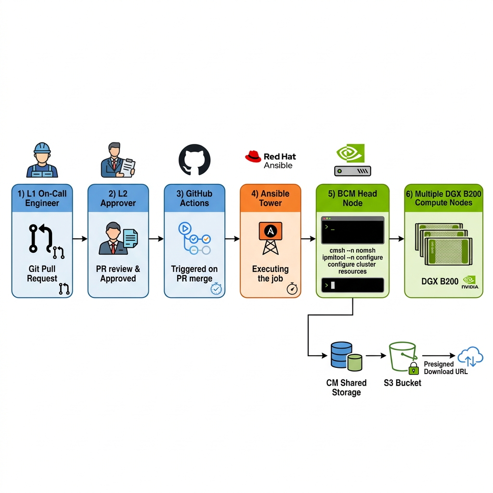
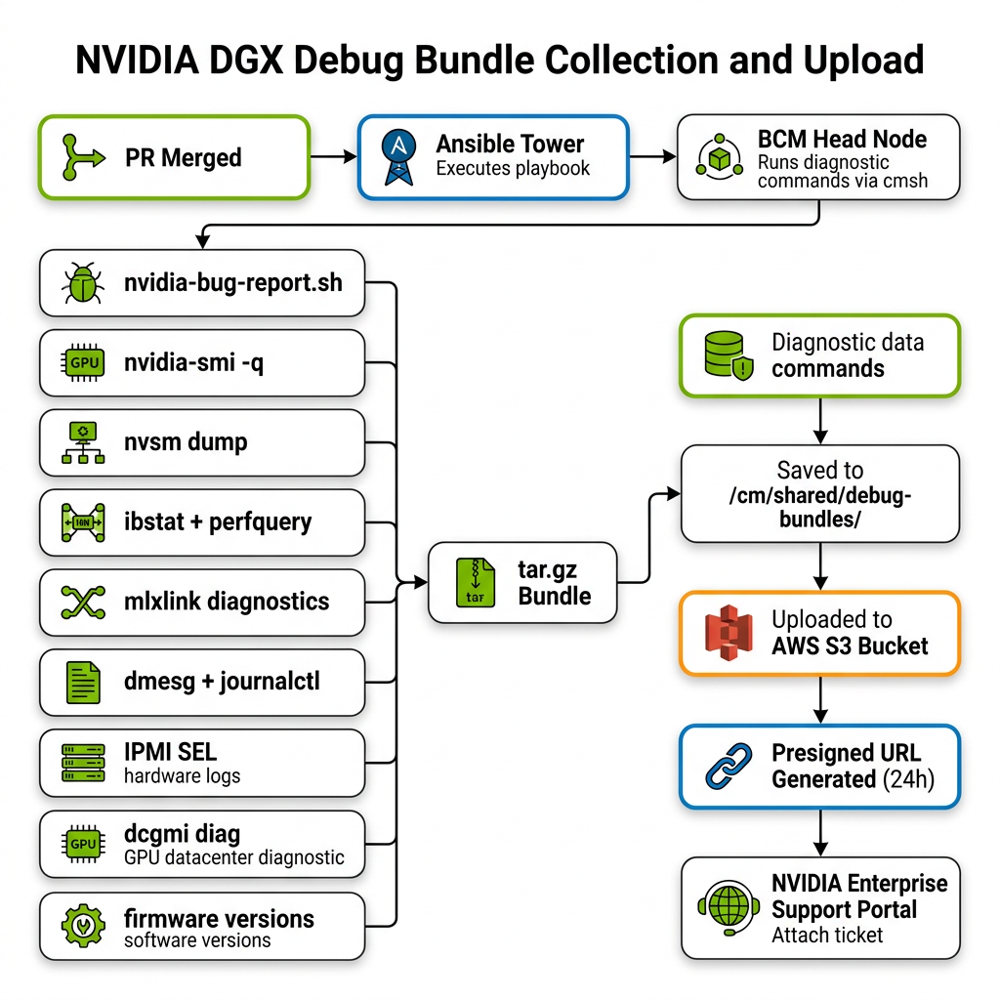
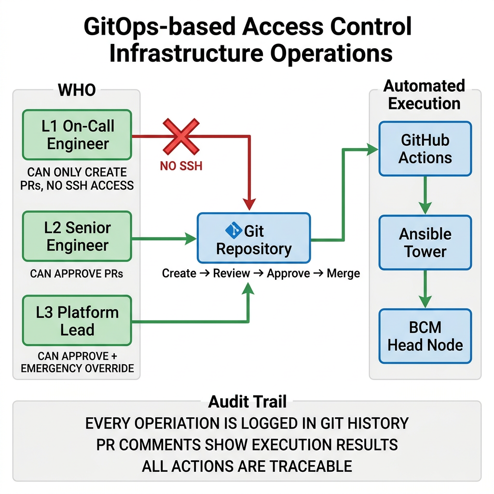

# BCM Ansible GitOps — Operations Guide

> **Audience:** L1 On-Call Engineers, L2 Senior Engineers, Platform Team  
> **Version:** 1.0  
> **Date:** 2026-03-06  
> **Fleet:** 66× NVIDIA DGX B200 (64 customer + 2 buffer)

---

## 1. How the Pipeline Works



### End-to-End Flow

1. **L1 On-Call Engineer** detects an issue (alert, monitoring, customer report)
2. Creates an **operation request YAML** file in `operation-requests/`
3. Opens a **Pull Request** targeting the `main` branch
4. **L2 Senior Engineer** reviews the PR — validates target nodes, operation type, reason
5. On **PR merge**, GitHub Actions is triggered automatically
6. GitHub Actions **validates** the YAML schema and **calls Ansible Tower** API
7. Ansible Tower **launches a job** using the appropriate playbook
8. The playbook runs on the **BCM head node** using `cmsh` (never SSH to compute nodes)
9. **Results** are posted back as a PR comment
10. For debug bundles: the tarball is uploaded to **S3** and a **download URL** is generated

> **KEY PRINCIPLE:** Nobody SSHes into compute nodes. All operations go through this pipeline.

---

## 2. Available Operations

### Day 0 — Provisioning

| Operation | When to Use | Playbook |
|-----------|-------------|----------|
| `day0_provision` | New node setup, re-image after RMA | `day0_provision.yml` |

### Day 2 — Routine Operations

| Operation | When to Use | Playbook |
|-----------|-------------|----------|
| `day2_reboot` | Node unresponsive, post-maintenance reboot | `day2_reboot.yml` |
| `day2_power` | Power cycle, check power state | `day2_power.yml` |
| `day2_cordon` | Isolate node for maintenance/investigation | `day2_cordon.yml` |
| `day2_uncordon` | Return node to fleet (runs sanity first) | `day2_uncordon.yml` |
| `day2_bcm_status` | Change BCM status (UP/CLOSED) | `day2_bcm_status.yml` |
| `day2_gpu_reset` | Clear GPU errors, restart services | `day2_gpu_reset.yml` |
| `day2_ib_reset` | Clear IB error counters | `day2_ib_reset.yml` |
| `day2_service_restart` | Restart fabricmanager, DCGM, etc. | `day2_service_restart.yml` |
| `firmware_check` | Check/update firmware versions | `firmware_check.yml` |

### Debug — NVIDIA Support Bundles

| Operation | What It Collects | When to Use |
|-----------|-----------------|-------------|
| `debug_bundle` | **Everything** — GPU + IB + NVSM + system + firmware | NVIDIA support case |
| `debug_nvsm_dump` | NVSM dump + health | NVSM-specific issue |
| `debug_ib_diag` | ibstat, perfquery, mlxlink, ibdiagnet | InfiniBand issues |
| `debug_gpu_diag` | nvidia-smi, nvidia-bug-report.sh, dcgmi | GPU issues |
| `debug_logs` | dmesg, journalctl, IPMI SEL, kern.log | System-level issues |

---

## 3. Step-by-Step: How to Request an Operation

### Step 1: Clone the Repo

```bash
git clone https://github.com/<org>/bcm-ansible-gitops.git
cd bcm-ansible-gitops
```

### Step 2: Create Your Operation Request

```bash
# Create a branch
git checkout -b ops/<your-operation>

# Copy the template
cp operation-requests/_template.yml operation-requests/<descriptive-name>.yml

# Edit the file
```

### Step 3: Fill In the YAML

Example — Reboot a node:
```yaml
operation: day2_reboot
targets:
  - dgx-b200-042
parameters:
  reboot_type: graceful
  ticket_id: INC-7821
requested_by: your.email@company.com
approved_by: ""
reason: "Node unresponsive after GPU XID 79 — graceful reboot to recover"
```

Example — Collect debug bundle:
```yaml
operation: debug_bundle
targets:
  - dgx-b200-015
parameters:
  ticket_id: NV-CASE-44210
  upload_to_s3: true
requested_by: your.email@company.com
approved_by: ""
reason: "NVIDIA support requested full debug bundle for GPU DBE errors"
```

Example — Cordon multiple nodes:
```yaml
operation: day2_cordon
targets:
  - dgx-b200-028
  - dgx-b200-029
parameters:
  ticket_id: INC-8034
  reason_type: maintenance
requested_by: your.email@company.com
approved_by: ""
reason: "Planned firmware upgrade for nodes 028-029"
```

### Step 4: Commit and Push

```bash
git add operation-requests/<your-file>.yml
git commit -m "ops: <brief description>"
git push origin ops/<your-operation>
```

### Step 5: Create the Pull Request

- Go to GitHub → Create Pull Request
- Fill in the PR template (operation type, target nodes, reason, rollback plan)
- Add an L2 reviewer

### Step 6: Wait for Approval and Results

- L2 reviews and merges the PR
- GitHub Actions automatically executes the operation
- Results appear as a PR comment within minutes

---

## 4. Debug Bundle → NVIDIA Support Ticket



### What the Debug Bundle Contains

| Category | Files | Key Commands |
|----------|-------|-------------|
| **GPU** | nvidia-smi-query.txt, nvidia-bug-report, dcgmi-diag-r1.txt | `nvidia-smi -q`, `nvidia-bug-report.sh`, `dcgmi diag -r 1` |
| **IB** | ibstat.txt, perfquery.txt, mlxlink.txt | `ibstat`, `perfquery -x`, `mlxlink -d mlx5_X -m` |
| **NVSM** | nvsm-dump.txt, nvsm-show-health.txt | `nvsm dump`, `nvsm show health` |
| **System** | dmesg.txt, journalctl-24h.txt, ipmi-sel.txt | `dmesg`, `journalctl --since '24h ago'`, `ipmitool sel elist` |
| **Firmware** | nvfwupd-versions.txt, bmc-fw-version.txt | `nvfwupd show_version`, `ipmitool mc info` |

### After the Bundle is Generated

1. The bundle is saved to `/cm/shared/debug-bundles/<node>/<timestamp>/`
2. A tarball `nvidia-debug-bundle_<node>_<timestamp>.tar.gz` is created
3. The tarball is uploaded to S3
4. A **presigned download URL** (valid for 24 hours) is generated
5. The URL is posted as a **PR comment** — click to download
6. Attach the `.tar.gz` to your NVIDIA Enterprise Support case

### Re-Generate a Download URL

If the 24-hour URL has expired:

```bash
./scripts/generate_presigned_url.sh dgx-b200-042 20260306_143022
```

---

## 5. Access Control Model



### Role-Based Permissions

| Role | Can Create PRs | Can Approve PRs | SSH Access |
|------|---------------|----------------|------------|
| **L1 On-Call** | ✅ Yes | ❌ No | ❌ No |
| **L2 Senior** | ✅ Yes | ✅ Yes | ❌ No |
| **L3 Lead** | ✅ Yes | ✅ Yes | 🟡 Emergency only |

### Audit Trail

Every operation creates a permanent audit trail:
- **Git history** — who requested what, when, and why
- **PR comments** — execution results, success/failure, Tower job ID
- **Ansible Tower logs** — full command output for each task
- **S3 metadata** — debug bundles tagged with node, timestamp, fleet

---

## 6. Operations Parameter Reference

### Reboot Types
| Type | Mechanism | When to Use |
|------|-----------|-------------|
| `graceful` | `cmsh exec 'reboot'` | Default — safe OS-level reboot |
| `hard` | `cmsh power reset` | Node OS is frozen |
| `ipmi` | `ipmitool chassis power reset` | Node completely unresponsive |

### Power Actions
| Action | BCM Command | Description |
|--------|-------------|-------------|
| `status` | `power status` | Check power state |
| `on` | `power on` | Power on node |
| `off` | `power off` | Power off node |
| `reset` | `power reset` | Hard power cycle |

### Cordon Reason Types
| Type | Slurm Reason | When to Use |
|------|-------------|-------------|
| `fault` | `fault-detected-<TICKET>` | Unplanned — alert or incident |
| `maintenance` | `planned-maint-<TICKET>` | Planned — firmware, config |
| `rma` | `rma-active-<TICKET>` | Hardware replacement |

---

## 7. Troubleshooting the Pipeline

| Issue | Cause | Fix |
|-------|-------|-----|
| PR merged but no action | YAML not in `operation-requests/` | Ensure file is in the correct directory |
| Validation fails | Invalid operation name or missing fields | Check against `_template.yml` schema |
| Tower job fails to launch | Token expired or Tower unreachable | Check `ANSIBLE_TOWER_HOST` and `ANSIBLE_TOWER_TOKEN` secrets |
| Tower job fails | cmsh command error on head node | Check Tower job logs → fix and retry |
| S3 upload fails | AWS credentials missing or expired | Verify IAM role/credentials on head node |
| Download URL expired | Presigned URL > 24h old | Run `scripts/generate_presigned_url.sh` |

---

## 8. AWS S3 Setup

### Deploy the CloudFormation Stack

```bash
aws cloudformation deploy \
  --template-file cloudformation/nvidia-debug-s3.yaml \
  --stack-name nvidia-debug-bundles \
  --capabilities CAPABILITY_NAMED_IAM \
  --parameter-overrides \
    Environment=production \
    RetentionDays=365 \
    GlacierTransitionDays=90
```

### Get the Bucket Name

```bash
aws cloudformation describe-stacks \
  --stack-name nvidia-debug-bundles \
  --query 'Stacks[0].Outputs[?OutputKey==`BucketName`].OutputValue' \
  --output text
```

### Configure Head Node AWS Credentials

For EC2-based head nodes — attach the instance profile:
```bash
aws ec2 associate-iam-instance-profile \
  --instance-id <HEAD_NODE_INSTANCE_ID> \
  --iam-instance-profile Name=bcm-debug-bundle-profile-production
```

For on-prem head nodes — use the IAM user credentials:
```bash
aws configure --profile bcm-uploader
# Enter the Access Key ID and Secret from CloudFormation outputs
```

---

## 9. Common Scenarios

### Scenario A: Node Showing GPU XID 79

1. Create operation: `day2_cordon` (isolate the node)
2. Create operation: `debug_bundle` (collect diagnostics for NVIDIA)
3. Download the debug bundle from S3 URL in PR comment
4. Open NVIDIA support case, attach the bundle
5. Once resolved: `day2_gpu_reset` → `day2_uncordon`

### Scenario B: IB Link Flapping

1. `day2_cordon` the affected node
2. `debug_ib_diag` to collect IB diagnostics
3. `day2_ib_reset` to clear counters and verify
4. If resolved: `day2_uncordon`
5. If persists: Open NVIDIA case with IB diag bundle

### Scenario C: Planned Firmware Upgrade

1. `day2_cordon` (with `reason_type: maintenance`)
2. `firmware_check` to verify current versions
3. Use `firmware_check` with `update_firmware: true` to update
4. `day2_reboot` (graceful) to activate new firmware
5. `day2_uncordon` (auto-runs sanity check)

### Scenario D: Post-RMA Validation

1. `firmware_check` to verify new component firmware
2. `debug_gpu_diag` to run GPU diagnostics
3. `day2_gpu_reset` to clean up GPU state
4. `day2_uncordon` (sanity check validates everything)

---

> *CIC Platform Engineering — BCM Ansible GitOps Operations Guide v1.0*
