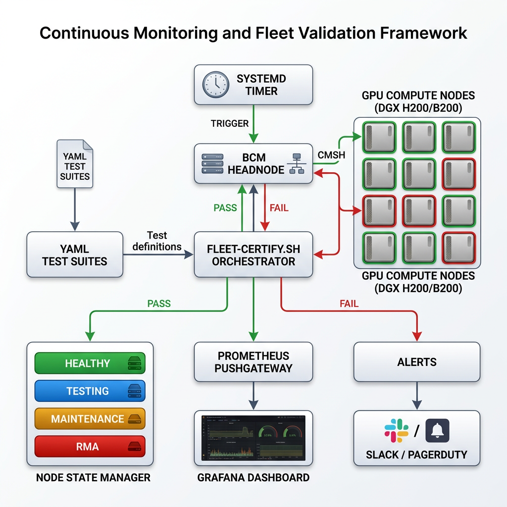
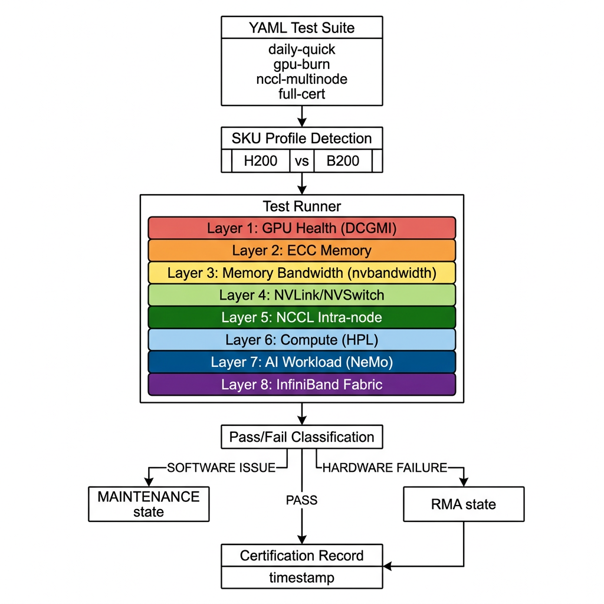
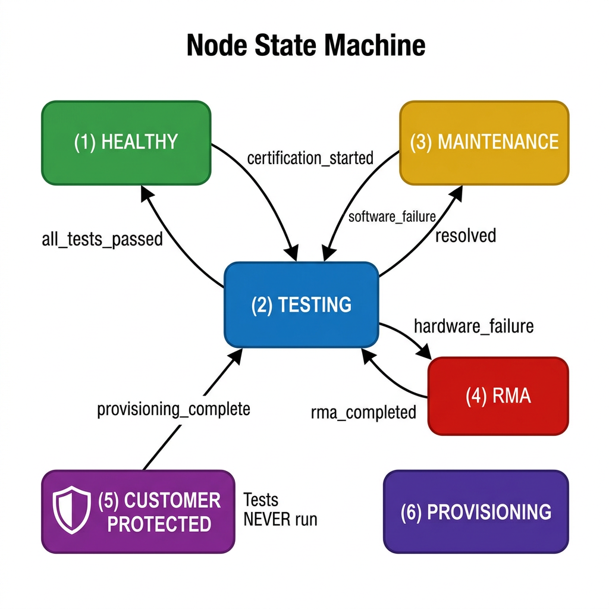

# Continuous Monitoring and Fleet Validation Framework

**Daily proactive node certification for BCM-managed GPU fleets (H200/B200).**

YAML-extensible test suites · Automatic node state transitions · Grafana dashboards with alerting · systemd-triggered daily runs · Multi-node NCCL via MPI

---

## Architecture



## Quick Start

```bash
# Install on BCM headnode
sudo ./install.sh

# Manual dry run (no state changes)
./bin/fleet-certify.sh --suite daily-quick --dry-run

# Run daily certification
./bin/fleet-certify.sh --suite daily-quick

# Full certification for specific nodes
./bin/fleet-certify.sh --suite full-certification --nodes dgx-b200-001,dgx-b200-002

# View node states
./bin/node-state-manager.sh summary

# Multi-node NCCL test
./bin/nccl-multinode-runner.sh --nodes dgx-b200-001,dgx-b200-002 --sku b200

# Generate Grafana dashboard
python3 dashboards/generate_dashboard.py
```

## Directory Structure

```
fleet-validator/
├── bin/                                    # Executable scripts
│   ├── fleet-certify.sh                    # Main orchestrator (systemd-triggered)
│   ├── run-test-suite.sh                   # YAML-driven test executor
│   ├── node-state-manager.sh               # BCM state transitions
│   ├── collect-metrics.sh                  # Prometheus pushgateway metrics
│   ├── certification-report.sh             # JSON cert records
│   └── nccl-multinode-runner.sh            # Multi-node NCCL via MPI
│
├── config/
│   ├── test-suites/                        # YAML test definitions
│   │   ├── daily-quick.yml                 #   ~20 min daily health pulse
│   │   ├── gpu-burn.yml                    #   ~2 hr GPU stress
│   │   ├── nccl-multinode.yml              #   ~1 hr multi-node NCCL
│   │   └── full-certification.yml          #   ~3.5 hr all 8 layers
│   ├── sku-profiles/                       # GPU SKU thresholds
│   │   ├── h200.yml                        #   H200 (NVLink 4)
│   │   └── b200.yml                        #   B200 (NVLink 5)
│   └── node-states.yml                     # State machine definition
│
├── dashboards/
│   ├── generate_dashboard.py               # Dashboard generator
│   ├── fleet-validation-dashboard.json     # Generated Grafana dashboard
│   └── alerting-rules.yml                  # Prometheus alerting rules
│
├── systemd/
│   ├── fleet-validator.service             # systemd service unit
│   └── fleet-validator.timer               # Daily timer (02:00 UTC)
│
├── docs/images/                            # Architecture diagrams
├── install.sh                              # One-command installer
└── README.md                               # This file
```

## Test Suites

| Suite | Tests | Duration | Use Case |
|-------|-------|----------|----------|
| `daily-quick` | 9 tests | ~20 min | Daily health pulse |
| `gpu-burn` | 8 tests | ~2 hr | GPU-focused stress |
| `nccl-multinode` | 3 tests | ~1 hr/pair | Multi-node fabric |
| `full-certification` | 17 tests | ~3.5 hr | Day-0 / Post-RMA |

### The 8 Certification Layers



| Layer | Component | Tests |
|-------|-----------|-------|
| 1 | GPU Hardware Health | DCGMI R1/R3/R4 |
| 2 | GPU Memory & ECC | ECC error check |
| 3 | Memory Bandwidth | nvbandwidth (H2D, D2D, bidir) |
| 4 | NVLink & NVSwitch | Link status, error counters |
| 5 | Intra-Node NCCL | AllReduce, AllGather, ReduceScatter |
| 6 | Compute (HPL) | High-Performance Linpack |
| 7 | AI Workload (NeMo) | LLM inference benchmark |
| 8 | InfiniBand Fabric | Port health, error counters |

## Adding New Tests

Drop a YAML file in `config/test-suites/`. No code changes required.

```yaml
name: my-custom-suite
description: "My custom test suite"
estimated_duration_minutes: 30
sku_profiles: [h200, b200]
schedule: "weekly"

tests:
  - name: my_custom_test
    description: "Description of what this tests"
    command: "my-test-command --flag"
    timeout_seconds: 300
    pass_criteria:
      type: grep_absent        # or: grep_present, output_equals, bandwidth_gte, etc.
      pattern: "FAIL"
    failure_class: hardware     # or: software
    metrics:
      - name: my_metric
        type: gauge
        extract: "exit_code"
```

### Pass Criteria Types

| Type | Description | Parameters |
|------|-------------|------------|
| `grep_absent` | Fail if pattern found | `pattern` |
| `grep_present` | Pass if pattern found | `pattern` |
| `output_equals` | Output matches exactly | `expected` |
| `field_equals` | Regex field matches value | `field_pattern`, `expected` |
| `bandwidth_gte` | NCCL bus bandwidth ≥ SKU threshold | `threshold_key` |
| `performance_gte` | HPL TFLOPS ≥ SKU threshold | `threshold_key` |
| `all_values_below` | All numeric values < threshold | `threshold` |
| `value_gte` | Single numeric value ≥ threshold | `threshold` |

## Node State Machine



| State | Description | BCM Status | Tests Run? |
|-------|-------------|------------|------------|
| **Healthy** | Certified, ready for workloads | UP | ✅ |
| **Testing** | Certification in progress | TESTING | ✅ |
| **Maintenance** | Software issue, needs intervention | DRAINED | ❌ |
| **RMA** | Hardware failure, needs replacement | DRAINED | ❌ |
| **Customer Protected** | Assigned to customer | UP | ❌ Never |
| **Provisioning** | Being reimaged | INSTALLING | ❌ |

### Customer Protection

Nodes are protected from testing via three methods:
1. **Explicit file**: Add hostname to `/etc/fleet-validator/protected-nodes.txt`
2. **BCM allocation**: Nodes with active BCM allocation are skipped
3. **K8s label**: Nodes with `node-role.kubernetes.io/customer=true` label

## Grafana Dashboard

**Dashboard Title**: *Continuous Monitoring and Fleet Validation Framework*

| Row | Panels |
|-----|--------|
| Fleet Overview | Total nodes, certified, pass rate, last run, active alerts |
| Node State Distribution | Pie chart + certification timeline |
| Test Results Matrix | Node × Test pass/fail table |
| GPU Stress Metrics | DCGMI results, ECC errors, GPU temperature |
| NCCL Bandwidth | AllReduce, AllGather, ReduceScatter per node |
| Compute Performance | HPL TFLOPS, NeMo inference TFLOPS |
| Memory Bandwidth | nvbandwidth H2D, D2D, bidirectional |
| Alerts & History | Active alerts, certification trends |

### Alerting Rules

| Alert | Severity | Trigger |
|-------|----------|---------|
| `FleetCertificationFailed` | warning | Node failed certification |
| `FleetNodeHardwareFailure` | critical | Hardware failure → RMA |
| `FleetNodeSoftwareIssue` | warning | Software issue → maintenance |
| `FleetCertificationStale` | warning | No cert in 48h |
| `FleetCertPassRateLow` | critical | Pass rate < 90% |
| `FleetNCCLBandwidthLow` | warning | NCCL bandwidth below threshold |

## SKU Profiles

### B200 (NVLink 5)

| Metric | Threshold |
|--------|-----------|
| NCCL AllReduce BusBW | ≥ 380 GB/s |
| NCCL AllGather BusBW | ≥ 350 GB/s |
| nvbandwidth D2D | ≥ 1600 GB/s |
| HPL | ≥ 60 TFLOPS |

### H200 (NVLink 4)

| Metric | Threshold |
|--------|-----------|
| NCCL AllReduce BusBW | ≥ 300 GB/s |
| NCCL AllGather BusBW | ≥ 280 GB/s |
| nvbandwidth D2D | ≥ 800 GB/s |
| HPL | ≥ 30 TFLOPS |

## systemd Timer

- **Service**: `fleet-validator.service`
- **Timer**: `fleet-validator.timer` — daily at 02:00 UTC
- **Logs**: `journalctl -u fleet-validator.service`

```bash
# Check timer status
systemctl status fleet-validator.timer
systemctl list-timers fleet-validator.timer

# Manual trigger
systemctl start fleet-validator.service

# View logs
journalctl -u fleet-validator.service --since today
```

## Certification Records

JSON records stored in `/var/lib/fleet-validator/certifications/`:

```json
{
  "node": "dgx-b200-001",
  "timestamp_utc": "2026-03-11T09:00:00+00:00",
  "suite": "daily-quick",
  "status": "CERTIFIED",
  "certified": true,
  "tests_total": 9,
  "tests_passed": 9,
  "tests_failed": 0,
  "failure_class": "none",
  "operator": "fleet-validator",
  "version": "1.0.0"
}
```

## Integration with BCM

All operations are **cmsh-native** — no direct SSH to compute nodes:

```bash
# Test execution
cmsh -c "device; use NODE; exec 'dcgmi diag -r 1'"

# State transitions
cmsh -c "device; use NODE; set status DRAINED; commit"

# Notes/labels
cmsh -c "device; use NODE; set notes 'fleet-validator: CERTIFIED 2026-03-11'; commit"
```
