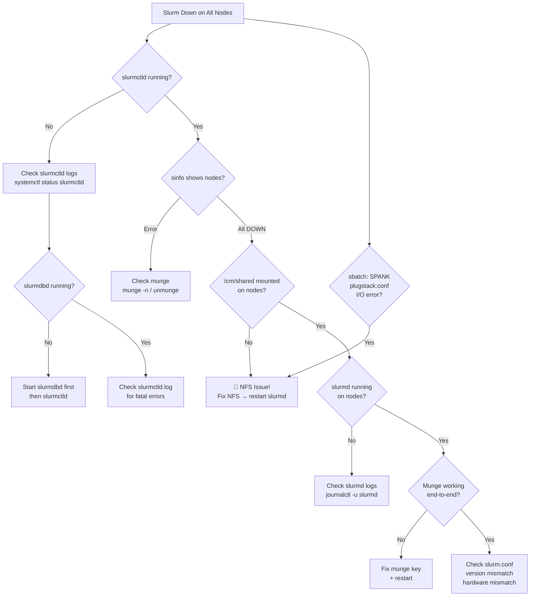

# SOP-300: Slurm Troubleshooting on BCM — Complete Runbook

> **Scope**: Diagnosing and recovering Slurm when it is down across all BCM-managed nodes.
> **Audience**: Platform / SRE / Infra Engineers with BCM head node access.
> **Last Updated**: 2026-03-18

---

## Table of Contents

1. [Quick-Start Triage (Head Node)](#1-quick-start-triage-head-node)
2. [BCM-Level Slurm Diagnostics (Head Node)](#2-bcm-level-slurm-diagnostics-head-node)
3. [Slurm Service Diagnostics (Head Node)](#3-slurm-service-diagnostics-head-node)
4. [Compute Node Diagnostics (Per-Node)](#4-compute-node-diagnostics-per-node)
5. [NFS / `/cm/share` Dependency Analysis](#5-nfs--cmshare-dependency-analysis)
6. [Slurm Configuration Validation](#6-slurm-configuration-validation)
7. [Database (SlurmDBD) Diagnostics](#7-database-slurmdbd-diagnostics)
8. [Network & Firewall Checks](#8-network--firewall-checks)
9. [Recovery Procedures](#9-recovery-procedures)
10. [Common Root Causes Summary](#10-common-root-causes-summary)

---

## 1. Quick-Start Triage (Head Node)

Run these commands **first** from the **BCM head node** to get a 60-second snapshot of the situation.

```bash
# ---------- 1a. Is slurmctld running on the head node? ----------
systemctl status slurmctld
# Expected: active (running). If dead/failed, Slurm is completely down.

# ---------- 1b. Can sinfo reach the controller? ----------
sinfo
# Expected: list of partitions and node states.
# If "error: ...", slurmctld is unreachable.

# ---------- 1c. What state are nodes in? ----------
sinfo -N -l
# Shows every node with state: idle, alloc, down, drain, etc.
# If ALL nodes show "down*" or "drain", the issue is cluster-wide.

# ---------- 1d. Quick node summary ----------
sinfo -s
# Compact summary: AVAIL / UP / DOWN / DRAIN counts per partition

# ---------- 1e. Check for pending/stuck jobs ----------
squeue -a
# If jobs are stuck in PD (pending) state with reason "Nodes required
# for job are DOWN" — confirms nodes are unavailable.
```

---

## 2. BCM-Level Slurm Diagnostics (Head Node)

BCM manages Slurm via its own overlay. These commands check whether BCM **thinks** Slurm is configured and healthy.

### 2a. cmsh — Check Slurm WLM Configuration

```bash
# Enter cmsh interactive mode
cmsh

# Check the workload manager configuration
wlm
show
# Look for: Type = Slurm, Enabled = yes

# Check which Slurm version BCM is managing
wlm
get type
get version

# Exit cmsh
quit
```

### 2b. cmsh — Check Node Roles & Slurm Overlay

```bash
cmsh -c "device; foreach -n node* (get roles)"
# Verify that compute nodes have the "slurm-client" or equivalent role.

cmsh -c "device; foreach -n node* (status)"
# Check BCM thinks nodes are UP and reachable.

cmsh -c "device; foreach -n node* (get powerstatus)"
# Confirm nodes are physically powered on.
```

### 2c. cmsh — Check Slurm Service Status via BCM

```bash
cmsh -c "device; foreach -n node* (services; show)"
# Lists all services BCM manages on each node, including slurmd.
# Look for slurmd being "stopped" or "failed".
```

### 2d. cmd (Bright Cluster Manager Daemon) Logs

```bash
# BCM daemon logs — may show why Slurm deployment failed
journalctl -u cmd -n 200 --no-pager

# Also check
cat /var/log/cmd.log 2>/dev/null
tail -200 /var/log/cmd.log
```

### 2e. BCM Event Log

```bash
# cmsh event viewer — shows node health events, provisioning failures
cmsh -c "device; foreach -n node* (eventlog)"

# Or for all cluster events
cmsh -c "main; eventlog"
```

### 2f. Check if BCM Software Image has Slurm Packages

```bash
cmsh -c "softwareimage; list"
# Note the image name assigned to compute nodes

cmsh -c "softwareimage; use default-image; get packages" | grep -i slurm
# Confirm slurm packages are in the image
# If empty — Slurm was never installed in the image!

# Alternative: check from filesystem
ls /cm/images/default-image/etc/slurm/ 2>/dev/null
rpm -qa --root=/cm/images/default-image/ | grep -i slurm
# (adjust image name as needed)
```

---

## 3. Slurm Service Diagnostics (Head Node)

### 3a. slurmctld Status & Logs

```bash
# ---------- Service status ----------
systemctl status slurmctld -l --no-pager
systemctl is-active slurmctld
systemctl is-enabled slurmctld

# ---------- Recent slurmctld logs ----------
journalctl -u slurmctld -n 500 --no-pager
journalctl -u slurmctld --since "1 hour ago" --no-pager

# ---------- Slurm log files (default locations on BCM) ----------
tail -500 /var/log/slurm/slurmctld.log
# Look for:
#   - "error:" lines
#   - "fatal:" lines (will cause slurmctld to exit)
#   - "Node XXX not responding" (node communication failure)
#   - "slurm_receive_msg" errors (network/auth issues)

# ---------- Check for repeated crashes ----------
journalctl -u slurmctld --since "24 hours ago" | grep -i "fail\|error\|fatal\|exit\|killed"
```

### 3b. slurmdbd Status (if using accounting)

```bash
systemctl status slurmdbd -l --no-pager
journalctl -u slurmdbd -n 200 --no-pager
tail -200 /var/log/slurm/slurmdbd.log

# If slurmdbd is down, slurmctld may hang or refuse to start
```

### 3c. Slurm Controller Detailed Diagnostics

```bash
# ---------- Controller ping ----------
scontrol ping
# Expected output: "Slurmctld(primary) at <hostname> is UP"
# If DOWN — the controller process is not running or unreachable.

# ---------- Show full controller config ----------
scontrol show config | head -50

# ---------- Show detailed node info ----------
scontrol show nodes
# For each node, look at:
#   - State (should be IDLE or ALLOCATED, not DOWN or DRAIN)
#   - Reason (explains WHY a node is down/drained)
#   - LastBusyTime
#   - SlurmdStartTime (if blank/old, slurmd never started)

# ---------- Show partitions ----------
scontrol show partitions

# ---------- Show specific problem nodes ----------
sinfo -R
# Lists all nodes not in UP state with their REASON string.
# Common reasons:
#   "Not responding"     → slurmd cannot reach slurmctld or vice versa
#   "Low socket*"        → hardware mismatch with slurm.conf
#   "Kill task failed"   → leftover job processes
#   "Node unexpectedly   → node rebooted or slurmd crashed
#     rebooted"

# ---------- Check Slurm cluster name ----------
scontrol show config | grep ClusterName
```

### 3d. Munge Authentication

```bash
# Slurm uses Munge for auth between slurmctld <-> slurmd.
# If munge is broken, ALL Slurm communication fails.

# On head node:
systemctl status munge
munge -n | unmunge
# Expected: "STATUS: Success (0)"
# If failure: munge key mismatch or daemon not running.

# Verify munge key exists and has correct permissions
ls -la /etc/munge/munge.key
# Should be: -r-------- 1 munge munge

# Check munge key is identical across nodes (from head node)
md5sum /etc/munge/munge.key
# Compare with nodes (see Section 4)

# Restart munge if needed
systemctl restart munge
```

---

## 4. Compute Node Diagnostics (Per-Node)

> **Access**: SSH from head node to specific compute nodes, or use BCM's
> `cmsh -c "device; use node001; runcmd '<cmd>'"` or use `pdsh`.

### 4a. Using pdsh (Parallel Shell) from Head Node

```bash
# ---------- Check slurmd on ALL nodes simultaneously ----------
pdsh -w node[001-064] "systemctl status slurmd" 2>&1 | dshbak -c

pdsh -w node[001-064] "systemctl is-active slurmd" 2>&1 | dshbak -c

# ---------- Check munge on ALL nodes ----------
pdsh -w node[001-064] "systemctl is-active munge" 2>&1 | dshbak -c

# ---------- Check if /cm/share is mounted ----------
pdsh -w node[001-064] "df -h /cm/share" 2>&1 | dshbak -c
pdsh -w node[001-064] "mount | grep cm/share" 2>&1 | dshbak -c

# ---------- Check slurmd log on nodes ----------
pdsh -w node[001-064] "tail -20 /var/log/slurm/slurmd.log" 2>&1 | dshbak -c

# ---------- Check munge key hash (must match head node) ----------
pdsh -w node[001-064] "md5sum /etc/munge/munge.key" 2>&1 | dshbak -c
```

### 4b. Using cmsh from Head Node (BCM Native)

```bash
# Run commands on nodes via cmsh
cmsh -c "device; foreach -n node* (runcmd 'systemctl status slurmd')"
cmsh -c "device; foreach -n node* (runcmd 'systemctl status munge')"
cmsh -c "device; foreach -n node* (runcmd 'mount | grep cm')"
cmsh -c "device; foreach -n node* (runcmd 'ls -la /cm/share/apps/slurm/')"
```

### 4c. SSH to a Specific Node for Deep Dive

```bash
ssh node001

# ---------- slurmd service ----------
systemctl status slurmd -l --no-pager
journalctl -u slurmd -n 200 --no-pager

# Look for common errors:
#   "error: Security violation" → munge key mismatch
#   "error: Unable to register" → cannot reach slurmctld
#   "fatal: Unable to determine this slurmd's NodeName" → hostname mismatch
#   "error: Invalid node state" → conf mismatch

# ---------- munge ----------
systemctl status munge -l --no-pager
munge -n | ssh <headnode> unmunge
# Tests end-to-end munge auth from node → head

# ---------- Network connectivity to slurmctld ----------
# Find controller hostname/port from config
grep SlurmctldHost /etc/slurm/slurm.conf 2>/dev/null || \
grep SlurmctldHost /cm/share/apps/slurm/var/etc/slurm.conf 2>/dev/null

# Test connectivity (default port 6817)
nc -zv <headnode> 6817
nc -zv <headnode> 6818   # slurmdbd port

# ---------- Check slurm user exists ----------
id slurm
# If no 'slurm' user, Slurm cannot run

# ---------- Check slurm.conf is accessible ----------
ls -la /etc/slurm/slurm.conf
cat /etc/slurm/slurm.conf | head -20
# On BCM, this may be a symlink to /cm/share/apps/slurm/...
ls -la /etc/slurm/
readlink -f /etc/slurm/slurm.conf

# ---------- Check node hostname matches slurm.conf ----------
hostname
hostname -s
# This MUST match a NodeName in slurm.conf or slurmd won't start.

# ---------- Check CPU/GPU/Memory matches slurm.conf expectations ----------
nproc
free -g
nvidia-smi -L 2>/dev/null
# Compare with what slurm.conf expects for this node.
```

---

## 5. NFS / `/cm/share` Dependency Analysis

> [!CAUTION]
> **YES — `/cm/share` NFS issues CAN and WILL cause Slurm to go down across ALL nodes.**
> This is one of the **most common cluster-wide Slurm failures** on BCM.

### Why `/cm/share` (or `/cm/shared`) is Critical for Slurm on BCM

> [!WARNING]
> BCM deployments use **either** `/cm/share` or `/cm/shared` as the NFS mount point.
> Check your environment — both paths appear in production. All commands below
> should be adapted to match your actual mount path.

On BCM-managed clusters, the Slurm configuration and binaries are typically stored on the shared NFS filesystem:

| Path | Purpose |
|------|---------|
| `/cm/shared/apps/slurm/` | Slurm binaries, libraries, and plugins |
| `/cm/shared/apps/slurm/etc/slurm.conf` | Main Slurm configuration file |
| `/cm/shared/apps/slurm/etc/slurm/plugstack.conf` | **SPANK plugin configuration** |
| `/cm/shared/apps/slurm/etc/slurm/gres.conf` | GPU / GRES resource definitions |
| `/cm/shared/apps/slurm/etc/slurm/cgroup.conf` | Cgroup configuration |
| `/cm/shared/apps/munge/` | Munge binaries and/or keys |
| `/cm/shared/apps/slurm/var/spool/` | Slurm spool directory (sometimes) |
| `/etc/slurm/slurm.conf` | Often a **symlink** → `/cm/shared/apps/slurm/...` |

**If `/cm/shared` is unmounted, stale, or slow:**
- `slurmd` cannot read `slurm.conf` → **refuses to start**
- `slurmd` cannot find Slurm binaries/plugins → **crashes**
- `sbatch`/`srun` fail with **SPANK plugin errors** → jobs cannot be submitted
- `munge` may fail if keys are on shared storage → **auth failure**
- `slurmctld` on head node may also be affected if it reads from `/cm/shared`
- Running `sinfo`, `squeue`, etc. may hang if they resolve to NFS-mounted binaries

### 5a. NFS Diagnostic Commands (Head Node)

```bash
# ---------- Check NFS server status on head node ----------
systemctl status nfs-server
systemctl status nfs-kernel-server  # (Ubuntu/Debian variant)

# ---------- What is being exported? ----------
exportfs -v
# Expected: /cm/share should be listed with appropriate options.

# ---------- Check for NFS errors ----------
journalctl -u nfs-server -n 100 --no-pager
dmesg | grep -i nfs | tail -30

# ---------- Check NFS mount stats (look for retrans/timeouts) ----------
nfsstat -c   # client stats
nfsstat -s   # server stats (on head node)

# ---------- Check for stale NFS handles or hung processes ----------
# On head node, see if anyone is stuck
ps aux | grep -i "D " | head -20  # Processes in D (uninterruptible) state

# ---------- Verify /cm/share is healthy on head node itself ----------
ls /cm/share/apps/slurm/ 2>/dev/null
time ls /cm/share/  # Should be instant. If slow → NFS issue.
stat /cm/share/apps/slurm/var/etc/slurm.conf
```

### 5b. NFS Diagnostic Commands (Compute Nodes — via pdsh)

```bash
# ---------- Is /cm/share mounted? ----------
pdsh -w node[001-064] "mount | grep cm/share" 2>&1 | dshbak -c
# If EMPTY for any node — NFS not mounted!

# ---------- Can nodes read from /cm/share? ----------
pdsh -w node[001-064] "ls /cm/share/apps/slurm/var/etc/slurm.conf" 2>&1 | dshbak -c
# "No such file" or hangs → NFS broken on that node

# ---------- Check for stale mounts ----------
pdsh -w node[001-064] "stat /cm/share/apps/slurm/ 2>&1" 2>&1 | dshbak -c
# "Stale file handle" → must remount

# ---------- Check /etc/fstab for NFS mount entry ----------
pdsh -w node[001-064] "grep cm/share /etc/fstab" 2>&1 | dshbak -c

# ---------- Check for D-state (stuck) processes ----------
pdsh -w node[001-064] "ps aux | awk '\$8 ~ /D/ {print}'" 2>&1 | dshbak -c
# If slurmd or munge are in D state — NFS hang confirmed.

# ---------- Time a simple read (detect slow NFS) ----------
pdsh -w node[001-064] "time cat /cm/share/apps/slurm/var/etc/slurm.conf > /dev/null" 2>&1 | dshbak -c
```

### 5c. SPANK plugstack.conf I/O Error (Confirmed Failure Mode)

> [!CAUTION]
> **This is a confirmed production failure pattern.** If you see the error below,
> the root cause is **NFS failure on `/cm/shared`**. Do NOT troubleshoot Slurm config
> or SPANK plugins — fix NFS first.

**Exact error observed:**
```
sbatch error spank failed to open
/cm/shared/apps/slurm/etc/slurm/plugstack.conf: Input/output error
error initialization failed
```

**What this means:**
- `sbatch` (or `srun`/`salloc`) tries to load SPANK plugins listed in `plugstack.conf`
- The file lives on NFS at `/cm/shared/apps/slurm/etc/slurm/plugstack.conf`
- `Input/output error` = the NFS mount is **stale**, **hung**, or **disconnected**
- This blocks ALL job submissions, not just specific jobs
- Even if `slurmctld` is running fine, users cannot submit any work

**Diagnosis commands (from head node or affected node):**
```bash
# 1. Try to read the file directly
cat /cm/shared/apps/slurm/etc/slurm/plugstack.conf
# If this hangs or returns "Input/output error" → NFS is broken

# 2. Check NFS mount health
stat /cm/shared/
# "Stale file handle" or hang = confirmed NFS failure

# 3. Check what plugstack.conf references
# (run this AFTER NFS is restored)
cat /cm/shared/apps/slurm/etc/slurm/plugstack.conf
# Each line loads a SPANK plugin. If any referenced .so file is also
# on /cm/shared, those will also fail with I/O errors.

# 4. Check ALL NFS-dependent Slurm configs at once
for f in plugstack.conf slurm.conf gres.conf cgroup.conf topology.conf; do
    echo -n "$f: "
    stat /cm/shared/apps/slurm/etc/slurm/$f 2>&1 | grep -o "regular file\|No such\|Input/output\|Stale"
done

# 5. From head node — test across all nodes
pdsh -w node[001-064] "cat /cm/shared/apps/slurm/etc/slurm/plugstack.conf > /dev/null 2>&1 && echo OK || echo FAIL" 2>&1 | dshbak -c
```

### 5d. NFS Recovery Steps

```bash
# If /cm/shared is stale on compute nodes:

# Option 1: Lazy unmount + remount
pdsh -w node[001-064] "umount -l /cm/shared && mount /cm/shared"

# Option 2: Force remount (if umount hangs)
pdsh -w node[001-064] "mount -o remount /cm/shared"

# Option 3: If NFS server on head node was restarted
systemctl restart nfs-server               # On head node
pdsh -w node[001-064] "systemctl restart nfs-client.target"

# Option 4: If nodes are diskless/stateless, reboot them
# (NFS will be remounted on boot from fstab/autofs)
cmsh -c "device; foreach -n node* (power reset)"

# ---------- AFTER NFS IS RESTORED ----------
# Verify the file is readable again
pdsh -w node[001-064] "cat /cm/shared/apps/slurm/etc/slurm/plugstack.conf > /dev/null && echo OK" 2>&1 | dshbak -c

# Restart Slurm stack
pdsh -w node[001-064] "systemctl restart munge && systemctl restart slurmd"

# Resume any nodes that went DOWN
scontrol update NodeName=ALL State=RESUME

# Verify job submission works
sbatch --wrap="hostname" -N1
squeue
```

### 5e. Filesystem Corruption on `/cm/shared` (Confirmed Failure Mode)

> [!CAUTION]
> **If `/cm/shared` returns filesystem errors (EIO, ESTALE, or "Structure needs cleaning"),
> you have underlying storage corruption.** NFS remount alone will NOT fix this — the
> underlying filesystem on the head node needs repair.

#### Step 1: Identify the Underlying Storage (Run on Head Node)

```bash
# What device backs /cm/shared?
df -hT /cm/shared
# Example output: /dev/sda3  xfs  1.8T  900G  900G  50% /cm/shared
# Note the DEVICE (/dev/sda3) and FILESYSTEM TYPE (xfs, ext4, etc.)

# Or if /cm/shared is already inaccessible:
mount | grep cm
cat /etc/fstab | grep cm

# Check if it's an LVM volume
lvs 2>/dev/null | grep cm
pvs 2>/dev/null
vgs 2>/dev/null

# Check dmesg for the actual filesystem errors
dmesg | grep -i "error\|corrupt\|EIO\|I/O error\|ext4\|xfs\|readonly" | tail -50

# Check for disk hardware errors
dmesg | grep -i "sd[a-z]\|scsi\|ata\|medium error\|sense" | tail -30
smartctl -a /dev/sda 2>/dev/null | grep -A5 "SMART overall"
```

#### Step 2: Assess the Damage

```bash
# Check filesystem mount status
mount | grep cm
# If mounted as "ro" (read-only) → kernel detected errors and remounted RO

# Check for pending I/O errors
cat /proc/mdstat 2>/dev/null     # RAID status (if applicable)
cat /sys/block/sda/device/state  # Should say "running", not "offline"

# Check kernel logs for filesystem-specific errors
journalctl -k --since "24 hours ago" | grep -i "filesystem\|ext4\|xfs\|corrupt\|error" | tail -50

# For XFS specifically:
journalctl -k | grep -i "xfs.*error\|xfs.*corrupt\|xfs.*shutdown" | tail -20
# "XFS: Filesystem has been shut down due to log error" = critical

# For EXT4 specifically:
journalctl -k | grep -i "ext4.*error\|ext4.*corrupt\|ext4.*remount" | tail -20
```

#### Step 3: Immediate Mitigation (Keep Cluster Alive)

```bash
# ==================================================================
# IMPORTANT: Before filesystem repair, prevent further damage
# ==================================================================

# 3a. Stop all Slurm services that depend on /cm/shared
systemctl stop slurmctld
systemctl stop slurmdbd 2>/dev/null
pdsh -w node[001-064] "systemctl stop slurmd" 2>/dev/null

# 3b. Stop any processes holding /cm/shared open
fuser -vm /cm/shared 2>/dev/null
lsof /cm/shared 2>/dev/null | head -20
# Kill if safe:
# fuser -km /cm/shared

# 3c. Stop NFS exports to prevent nodes from hanging
exportfs -ua   # Unexport all shares

# 3d. Unmount on compute nodes first (prevent D-state hangs)
pdsh -w node[001-064] "umount -l /cm/shared" 2>/dev/null
```

#### Step 4: Filesystem Repair

> [!WARNING]
> **Filesystem repair MUST be done with the filesystem UNMOUNTED.**
> Repairing a mounted filesystem can cause data loss.

```bash
# ==================================================================
# UNMOUNT THE FILESYSTEM FIRST
# ==================================================================
umount /cm/shared
# If umount hangs:
umount -l /cm/shared   # Lazy unmount
# If still stuck:
umount -f /cm/shared   # Force unmount

# ==================================================================
# FOR XFS FILESYSTEMS (most common on RHEL/BCM)
# ==================================================================

# 4a. Check XFS filesystem (read-only check first)
xfs_repair -n /dev/sda3        # DRY RUN - report only, no changes
# Review output. Look for:
#   "would have cleared inode"
#   "would have freed block"
#   "bad magic number"

# 4b. Run actual repair
xfs_repair /dev/sda3
# If it says "contains a dirty log":
xfs_repair -L /dev/sda3        # Zero the log (LAST RESORT - may lose recent data)

# 4c. For severe corruption:
xfs_repair -L -P /dev/sda3     # Aggressive repair + progress

# ==================================================================
# FOR EXT4 FILESYSTEMS
# ==================================================================

# 4a. Check and repair
e2fsck -n /dev/sda3             # DRY RUN first
e2fsck -fy /dev/sda3            # Force check + auto-fix
# -f = force even if clean
# -y = assume yes to all questions

# ==================================================================
# AFTER REPAIR
# ==================================================================

# 4d. Remount the filesystem
mount /cm/shared
mount | grep cm

# 4e. Verify the filesystem is healthy
ls -la /cm/shared/apps/slurm/
cat /cm/shared/apps/slurm/etc/slurm/plugstack.conf
stat /cm/shared/apps/slurm/etc/slurm/slurm.conf
```

#### Step 5: Restore Slurm Stack (After Filesystem Repair)

```bash
# 5a. Re-export NFS shares
exportfs -a
exportfs -v | grep cm

# 5b. Remount on compute nodes
pdsh -w node[001-064] "mount /cm/shared"
pdsh -w node[001-064] "ls /cm/shared/apps/slurm/ > /dev/null && echo OK || echo FAIL" 2>&1 | dshbak -c

# 5c. Restart Slurm (head node first, then nodes)
systemctl start munge
systemctl start slurmdbd
sleep 5
systemctl start slurmctld

pdsh -w node[001-064] "systemctl restart munge && systemctl restart slurmd"

# 5d. Resume nodes and verify
scontrol update NodeName=ALL State=RESUME
sinfo -N -l
sbatch --wrap="hostname" -N1
squeue
```

#### When to Escalate

| Situation | Action |
|-----------|--------|
| `xfs_repair` reports "bad superblock" | Filesystem may be unrecoverable — restore from backup |
| SMART reports disk errors | **Hardware failure** — replace disk, restore from backup |
| RAID degraded (`/proc/mdstat`) | Replace failed disk, rebuild RAID before fsck |
| LVM metadata corrupt | `vgcfgrestore`, then fsck — contact storage team |
| Data loss after repair | Restore `/cm/shared` from BCM backup or re-deploy BCM |
| Repeated corruption after repair | **Underlying hardware issue** — check cables, controller, disk health |

> [!IMPORTANT]
> **BCM Backup**: BCM typically backs up critical configuration under `/cm/node-installer/`
> and the head node's local config. If `/cm/shared` data is lost, BCM can regenerate
> Slurm configs via `cmsh → wlm → assign slurm → commit`, but custom SPANK plugins
> and user-installed software under `/cm/shared/apps/` may need manual restoration.

---

## 6. Slurm Configuration Validation

```bash
# ---------- Validate slurm.conf syntax ----------
slurmd -C
# Prints the detected hardware config of the head node. Use this to compare
# with what slurm.conf expects.

# ---------- On a compute node ----------
ssh node001 'slurmd -C'
# Compare NodeName, CPUs, Sockets, CoresPerSocket, RealMemory, Gres
# with the corresponding line in slurm.conf

# ---------- Check for config file consistency ----------
# On BCM, slurm.conf is typically centralized. Verify:
md5sum /etc/slurm/slurm.conf
pdsh -w node[001-064] "md5sum /etc/slurm/slurm.conf" 2>&1 | dshbak -c
# ALL should be identical. If not → some nodes have stale config.

# ---------- Check Slurm version consistency ----------
slurmctld -V
pdsh -w node[001-064] "slurmd -V" 2>&1 | dshbak -c
# Version mismatch between controller and daemon will cause failures.

# ---------- Debug mode — start slurmd in foreground ----------
# SSH to a problem node:
ssh node001
slurmd -D -vvv 2>&1 | head -100
# This shows exactly WHY slurmd refuses to start.
# Ctrl+C to stop.
```

---

## 7. Database (SlurmDBD) Diagnostics

```bash
# ---------- Is MariaDB/MySQL running? ----------
systemctl status mariadb
systemctl status mysql
# slurmdbd depends on the database. If DB is down, slurmdbd is down.
# If slurmdbd is down, slurmctld may hang waiting for it.

# ---------- Can slurmdbd connect to DB? ----------
tail -100 /var/log/slurm/slurmdbd.log
# Look for "Connection refused" or "Access denied"

# ---------- Check DB disk space ----------
df -h /var/lib/mysql
# If full, DB operations fail → slurmdbd fails → slurmctld hangs

# ---------- Test DB connectivity ----------
mysql -u slurm -p -e "SHOW DATABASES;" 2>/dev/null
# Or check what the slurmdbd.conf says:
grep Storage /etc/slurm/slurmdbd.conf 2>/dev/null
```

---

## 8. Network & Firewall Checks

```bash
# ---------- Required Slurm ports ----------
# slurmctld: 6817 (default)
# slurmd:    6818 (default)
# slurmdbd:  6819 (default)

# ---------- Check ports are listening on head node ----------
ss -tlnp | grep -E "681[789]"
# All three should show LISTEN state.

# ---------- Check firewall (head node) ----------
iptables -L -n | grep -E "681[789]"
firewall-cmd --list-all 2>/dev/null
ufw status 2>/dev/null

# ---------- Test port connectivity from compute node ----------
pdsh -w node[001-064] "nc -zv $(hostname) 6817 2>&1" 2>&1 | dshbak -c

# ---------- Check for DNS resolution issues ----------
pdsh -w node[001-064] "getent hosts $(hostname)" 2>&1 | dshbak -c
# Nodes must be able to resolve the controller hostname.

# ---------- Check /etc/hosts consistency ----------
pdsh -w node[001-064] "grep $(hostname) /etc/hosts" 2>&1 | dshbak -c
```

---

## 9. Recovery Procedures

### 9a. Restart Slurm Stack (Head Node First, Then Nodes)

```bash
# ===== STEP 1: Restart on Head Node =====
systemctl restart munge
systemctl status munge         # Verify running

systemctl restart slurmdbd     # If using accounting
sleep 5                        # Give DB time to initialize
systemctl status slurmdbd

systemctl restart slurmctld
systemctl status slurmctld

# ===== STEP 2: Restart on Compute Nodes =====
pdsh -w node[001-064] "systemctl restart munge"
pdsh -w node[001-064] "systemctl restart slurmd"

# ===== STEP 3: Verify =====
sinfo -N -l
scontrol ping
```

### 9b. Resume DOWN/DRAINED Nodes

```bash
# After fixing the underlying issue, bring nodes back:

# Resume specific nodes
scontrol update NodeName=node001 State=RESUME

# Resume ALL down nodes
scontrol update NodeName=ALL State=RESUME

# Resume a range
scontrol update NodeName=node[001-064] State=RESUME

# Verify
sinfo -N -l
```

### 9c. Full Slurm Re-deployment via BCM (Nuclear Option)

```bash
# If Slurm config is corrupt or missing, redeploy from BCM:
cmsh
wlm
# Re-assign or re-deploy Slurm
assign slurm
commit

# Or from device level, re-provision the overlay:
device
foreach -n node* (imageupdate)
commit
```

### 9d. Regenerate Munge Key (If Key Mismatch)

```bash
# On head node:
systemctl stop munge
dd if=/dev/urandom bs=1 count=1024 > /etc/munge/munge.key
chown munge:munge /etc/munge/munge.key
chmod 400 /etc/munge/munge.key
systemctl start munge

# Distribute to all nodes (BCM usually handles this, but manual):
pdsh -w node[001-064] "systemctl stop munge"
pdcp -w node[001-064] /etc/munge/munge.key /etc/munge/munge.key
pdsh -w node[001-064] "chown munge:munge /etc/munge/munge.key && chmod 400 /etc/munge/munge.key"
pdsh -w node[001-064] "systemctl start munge"

# Verify
munge -n | unmunge
pdsh -w node[001-064] "munge -n | ssh $(hostname) unmunge" 2>&1 | dshbak -c
```

---

## 10. Common Root Causes Summary

| # | Root Cause | Symptoms | Diagnosis Command | Fix |
|---|-----------|----------|-------------------|-----|
| 1 | **`/cm/share` NFS down/stale** | All slurmd fail to start, `slurm.conf` not found, D-state processes | `pdsh 'mount \| grep cm/share'` | Remount NFS, restart slurmd |
| 2 | **slurmctld not running** | `sinfo` returns error, all nodes unreachable | `systemctl status slurmctld` | Restart slurmctld, check logs |
| 3 | **Munge key mismatch** | "Security violation" in slurmd.log | `munge -n \| unmunge` + compare md5sums | Regenerate & redistribute key |
| 4 | **Munge daemon down** | Auth failures, slurmd/slurmctld refuse connections | `systemctl status munge` | Restart munge |
| 5 | **slurm.conf mismatch** | Nodes report wrong CPU/GPU/memory count | `slurmd -C` vs. slurm.conf | Update slurm.conf, `scontrol reconfigure` |
| 6 | **Slurm version mismatch** | "Protocol version" errors | `slurmctld -V` vs. `slurmd -V` | Align versions across cluster |
| 7 | **slurmdbd/DB down** | slurmctld hangs at startup, no accounting | `systemctl status slurmdbd` | Restart MariaDB + slurmdbd |
| 8 | **Firewall blocking ports** | "Connection refused" from nodes | `ss -tlnp \| grep 681` | Open ports 6817-6819 |
| 9 | **DNS/hostname mismatch** | "Unable to determine NodeName" | `hostname -s` vs. slurm.conf | Fix /etc/hosts or slurm.conf |
| 10 | **Disk full on head node** | slurmctld crashes, DB errors | `df -h /var/log /var/lib/mysql` | Free disk space |
| 11 | **BCM image missing Slurm** | slurmd binary not found on nodes | `cmsh softwareimage packages \| grep slurm` | Add Slurm to image, re-provision |
| 12 | **Node provisioning incomplete** | Nodes UP in BCM but slurmd never starts | `cmsh device status` | Re-provision via `imageupdate` |
| 13 | **SPANK plugstack.conf I/O error** | `sbatch` fails with "spank failed to open plugstack.conf: Input/output error" | `cat /cm/shared/apps/slurm/etc/slurm/plugstack.conf` | Fix NFS mount → restart slurmd |

---

## Recommended Triage Order



---

## Quick Copy-Paste: Full Diagnostic Script

Save this as `slurm_diag.sh` and run from the head node:

```bash
#!/bin/bash
# slurm_diag.sh — Rapid Slurm health check from BCM head node
set -euo pipefail

echo "========================================="
echo "  SLURM DIAGNOSTIC REPORT"
echo "  $(date)"
echo "  Head Node: $(hostname)"
echo "========================================="

echo ""
echo "=== 1. SLURMCTLD STATUS ==="
systemctl is-active slurmctld 2>/dev/null || echo "slurmctld: NOT RUNNING"
scontrol ping 2>/dev/null || echo "scontrol ping: FAILED"

echo ""
echo "=== 2. SLURMDBD STATUS ==="
systemctl is-active slurmdbd 2>/dev/null || echo "slurmdbd: NOT RUNNING"

echo ""
echo "=== 3. MUNGE STATUS ==="
systemctl is-active munge 2>/dev/null || echo "munge: NOT RUNNING"
munge -n 2>/dev/null | unmunge 2>/dev/null | grep STATUS || echo "munge test: FAILED"

echo ""
echo "=== 4. NFS /cm/share STATUS ==="
if mountpoint -q /cm/share 2>/dev/null; then
    echo "/cm/share: MOUNTED"
    time ls /cm/share/apps/slurm/ > /dev/null 2>&1 && echo "NFS read: OK" || echo "NFS read: SLOW/FAILED"
else
    echo "/cm/share: NOT MOUNTED — THIS IS LIKELY THE PROBLEM"
fi

echo ""
echo "=== 5. SINFO OUTPUT ==="
sinfo -N -l 2>/dev/null || echo "sinfo: FAILED (slurmctld unreachable)"

echo ""
echo "=== 6. DOWN/DRAINED NODES ==="
sinfo -R 2>/dev/null || echo "Cannot retrieve node reasons"

echo ""
echo "=== 7. NFS EXPORTS ==="
exportfs -v 2>/dev/null | grep cm || echo "No /cm exports found"

echo ""
echo "=== 8. LISTENING PORTS ==="
ss -tlnp | grep -E "681[789]" || echo "No Slurm ports listening!"

echo ""
echo "=== 9. RECENT SLURMCTLD ERRORS ==="
journalctl -u slurmctld --since "1 hour ago" --no-pager 2>/dev/null | grep -i "error\|fatal" | tail -20

echo ""
echo "=== 10. DISK SPACE ==="
df -h / /var/log /var/lib/mysql 2>/dev/null

echo ""
echo "=== 11. /cm/share ON COMPUTE NODES (via pdsh) ==="
if command -v pdsh &>/dev/null; then
    pdsh -w node[001-010] "mountpoint -q /cm/share && echo MOUNTED || echo NOT_MOUNTED" 2>&1 | sort || echo "pdsh failed"
else
    echo "pdsh not available — run checks manually on nodes"
fi

echo ""
echo "========================================="
echo "  DIAGNOSTIC COMPLETE"
echo "========================================="
```

---

> [!IMPORTANT]
> **Always start with NFS (`/cm/share`) and `slurmctld` status.** These two are the most common
> causes of cluster-wide Slurm outages on BCM. If `/cm/share` is unavailable, almost nothing
> else will work because Slurm binaries, configs, and plugins all live there.
