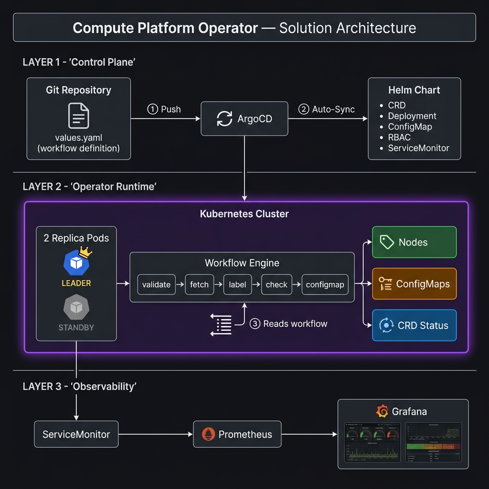
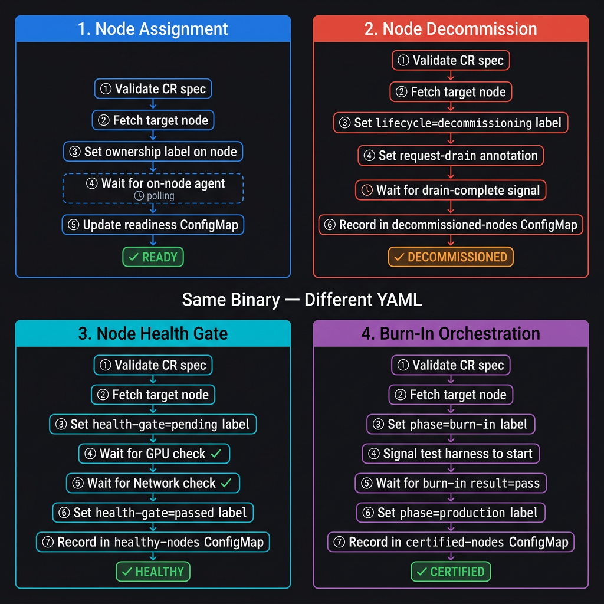
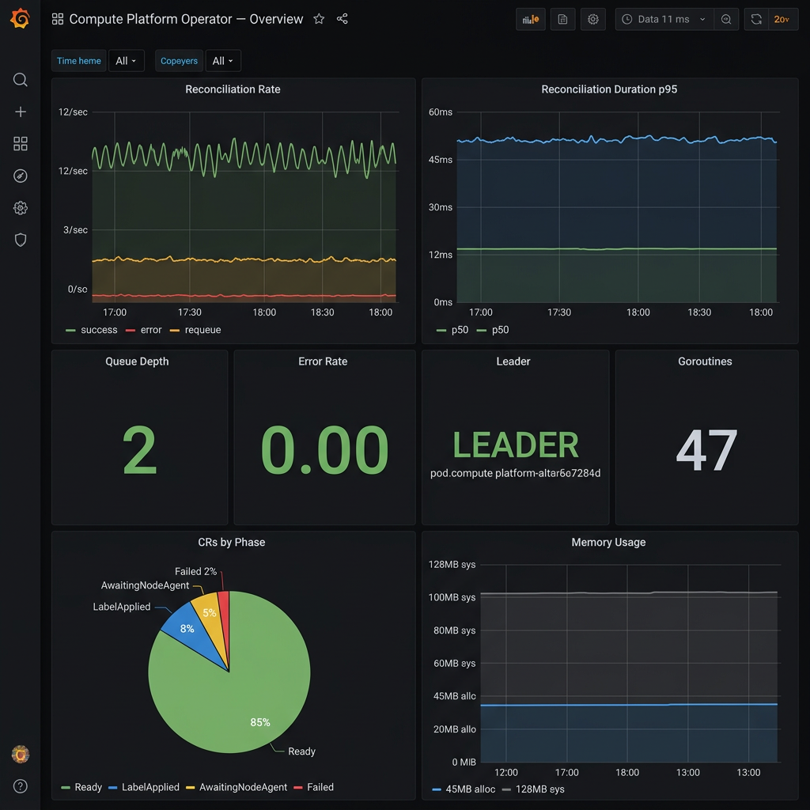
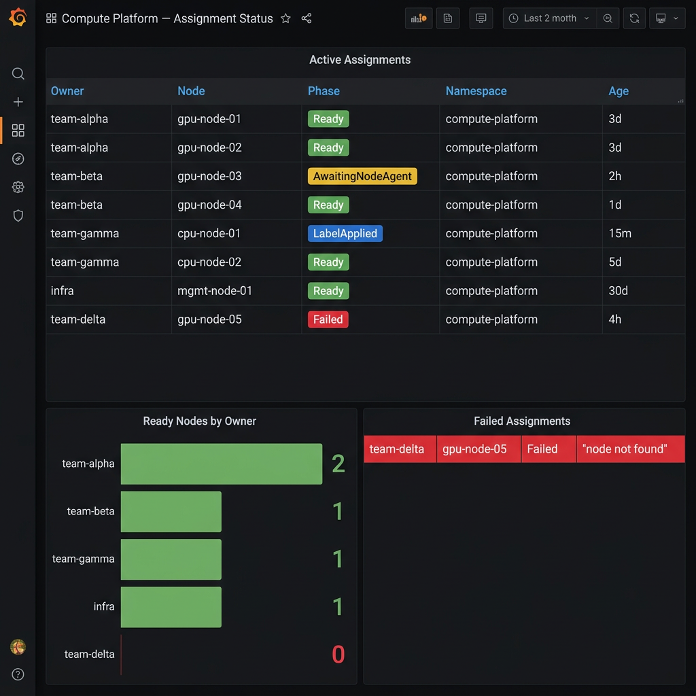

# Compute Platform Operator

## The Problem

In large-scale compute environments (GPU clusters, HPC, BMaaS), **node lifecycle management is manual and error-prone**:

- Assigning nodes to teams requires manual labeling and ConfigMap updates
- Decommissioning nodes needs coordinated drain → label → record sequences
- Burn-in testing of new hardware has no automated orchestration
- Health-gating nodes before production use requires ad-hoc scripting
- Swapping nodes between teams involves multiple manual steps
- No single source of truth for which nodes are assigned, healthy, or certified

**Every scenario above follows the same pattern**: validate → fetch node → modify labels/annotations → wait for external signal → record status. The only differences are *which* labels, *which* annotations, and *which* ConfigMaps.

## The Solution

A **single Kubernetes operator** whose entire behavior is defined in YAML. The operator binary contains **zero business logic** — it's a generic workflow engine that reads steps from a ConfigMap and executes them in order.

**Change the YAML → change the behavior. No code changes. No rebuild. No redeployment.**

---

## Solution Architecture



| Layer | What It Does |
|-------|-------------|
| **① Control Plane** | Platform team edits `values.yaml` in Git → ArgoCD auto-syncs → Helm renders the workflow ConfigMap |
| **② Operator Runtime** | 2-replica HA deployment with leader election. Active pod reads workflow steps from ConfigMap and executes them against Kubernetes resources |
| **③ Observability** | ServiceMonitor → Prometheus → Grafana dashboards show operator health and assignment status |

---

## Workflow Scenarios

All 4 scenarios use the **exact same operator binary** — only the YAML workflow definition changes.



### 1. Node Assignment

> Claim a node for a workload group. Label it, wait for the on-node agent to confirm setup, record readiness.

| Step | Action | What Happens |
|------|--------|-------------|
| ① | `validateSpec` | Ensures CR has owner name and node name |
| ② | `fetchNode` | Gets the target node from Kubernetes API |
| ③ | `setLabel` | Sets `compute-platform.io/owner=team-a` on the node |
| ④ | `checkAnnotation` | Polls until on-node agent sets `node-agent-ready=true` |
| ⑤ | `updateConfigMap` | Records `team-a.gpu-node-01=ready` in readiness ConfigMap |

**Node Swap**: Delete old CR (cleanup removes old label) → Create new CR with new owner. Same workflow.

---

### 2. Node Decommission

> Take a node out of service. Label it for decommission, signal the drain controller, wait for drain, record status.

| Step | Action | What Happens |
|------|--------|-------------|
| ① | `validateSpec` | Validates CR |
| ② | `fetchNode` | Gets the target node |
| ③ | `setLabel` | Sets `lifecycle=decommissioning` (scheduler stops placing workloads) |
| ④ | `setAnnotation` | Sets `request-drain=true` (signals drain controller) |
| ⑤ | `checkAnnotation` | Polls until drain controller sets `drain-complete=true` |
| ⑥ | `updateConfigMap` | Records node in `decommissioned-nodes` ConfigMap |

---

### 3. Node Health Gate

> Block a node from assignment until GPU and network checks pass.

| Step | Action | What Happens |
|------|--------|-------------|
| ① | `validateSpec` | Validates CR |
| ② | `fetchNode` | Gets the target node |
| ③ | `setLabel` | Sets `health-gate=pending` (blocks assignment workflows) |
| ④ | `checkAnnotation` | Polls for `gpu-check-passed=true` from GPU validator |
| ⑤ | `checkAnnotation` | Polls for `network-check-passed=true` from network validator |
| ⑥ | `setLabel` | Sets `health-gate=passed` (clears node for assignment) |
| ⑦ | `updateConfigMap` | Records node in `healthy-nodes` ConfigMap |

---

### 4. Burn-In Orchestration

> Orchestrate burn-in testing on new hardware. Isolate the node, signal the test harness, wait for results, certify.

| Step | Action | What Happens |
|------|--------|-------------|
| ① | `validateSpec` | Validates CR |
| ② | `fetchNode` | Gets the target node |
| ③ | `setLabel` | Sets `phase=burn-in` (isolates from production scheduling) |
| ④ | `setAnnotation` | Sets `burn-in-start=true` (signals test harness) |
| ⑤ | `checkAnnotation` | Polls for `burn-in-result=pass` from test harness |
| ⑥ | `setLabel` | Sets `phase=production` (node is now schedulable) |
| ⑦ | `updateConfigMap` | Records node in `certified-nodes` ConfigMap |

---

## Grafana Dashboards

### Operator Overview — *"Is the operator healthy?"*



| Panel | What To Watch For |
|-------|-------------------|
| **Reconciliation Rate** | Green (success) should be steady. Red spikes = errors. Orange = waiting for agents |
| **Duration p95** | Should stay under 50ms. If it climbs, API server is slow |
| **Queue Depth** | Green at 2. If >20, operator is falling behind |
| **Error Rate** | Must be 0.00. Any non-zero needs investigation |
| **LEADER** | Shows active pod. Rapid flipping = network issues |
| **CRs by Phase** | 85% Ready = healthy fleet. Growing "Failed" = problems |
| **Memory** | Stable ~45MB. Growth = leak |

### Assignment Status — *"Which nodes are assigned and are any stuck?"*



| Panel | What To Watch For |
|-------|-------------------|
| **Active Assignments** | Full inventory. Red "Failed" rows need attention |
| **Ready Nodes by Owner** | Capacity check. 0 = owner has no nodes |
| **Failed Assignments** | Every row is an action item |

---

## Quick Start

```bash
# Build and test
make build                    # Compile binary
make test                     # Run 66 unit tests
make coverage                 # Generate coverage report (84%)

# Deploy
helm install compute-platform-operator \
  charts/tenant-node-assignment-operator \
  --namespace compute-platform-system \
  --create-namespace

# Or via ArgoCD
kubectl apply -f argocd/project.yaml
kubectl apply -f argocd/application.yaml

# Create an assignment
kubectl apply -f config/samples/tenantnodeassignment_sample.yaml
```

## Project Structure

```
├── ARCHITECTURE-REVIEW.md          ← Detailed architecture & expert review
├── README.md                       ← This file
├── cmd/main.go                     ← Entrypoint (HA leader election)
├── internal/
│   ├── workflow/engine.go          ← Generic step engine (12 types)
│   ├── controller/                 ← Reconciler (step executor)
│   ├── config/                     ← YAML config loading
│   ├── labels/                     ← Go template expansion
│   └── readiness/                  ← ConfigMap CRUD manager
├── charts/                         ← Helm chart (7 templates)
│   └── values.yaml                 ← ★ ALL workflow config here
├── argocd/                         ← ArgoCD Application + Project
├── dashboards/                     ← Grafana JSON (2 dashboards)
├── docs/diagrams/                  ← Architecture & Grafana mockups
├── test/e2e/                       ← Minikube E2E test script
├── Dockerfile                      ← Multi-stage distroless build
└── Makefile                        ← Build, test, lint targets
```

## Key Numbers

| Metric | Value |
|--------|-------|
| Go source lines | ~1,200 |
| Unit tests | 66 |
| Test coverage | 84% |
| Step types | 12 |
| Workflow scenarios | 5 (assignment, swap, decommission, health gate, burn-in) |
| Helm templates | 7 |
| Grafana panels | 12 (across 2 dashboards) |
| Replicas (HA) | 2 |
| Container | distroless, nonroot, read-only FS |
